## Benchmark Comparison (Average ns/op)
| Test Case | GoRegexp | GoRegexpRe | Hyperscan-CGO | PCRE2-CGO | RE2-CGO |
|---|---|---|---|---|---|
| Anchors/pat=HTTP/1.1$ | 3216510.20 | 962325.20 | 992758.60 | 1036986.00 | 433040.00 |
| Anchors/pat=\bGET\b | 1522.20 | 141.32 | 1028791.60 | 1921.80 | 440984.60 |
| Anchors/pat=^127.0.0.1 | 40.03 | 12.52 | 889157.00 | 1646.60 | 443271.40 |
| Capturing/Email | 2579.20 | 8532404.00 | 641816.00 | 4452.80 | 190499.00 |
| Capturing/URI | 573.96 | 661214.00 | 1010420.20 | 2324.60 | 191918.60 |
| LargeAlternation/Count=10 | 34886.40 | 34575.60 | 575309.80 | 20842.40 | 947368.40 |
| LargeAlternation/Count=100 | 33094.60 | 29632.20 | 568090.00 | 22428.00 | 940581.40 |
| LargeAlternation/Count=1000 | 38331.40 | 28927.60 | 618083.20 | 36723.40 | 947302.40 |
| LargeAlternation/Count=10000 | 50005.80 | 29948.80 | N/A | N/A | 940778.80 |
| LiteralScan/pat=Sherlock | 360.90 | 23.34 | 609851.00 | 1470.80 | 214796.20 |
| LiteralScan/pat=The_Adventure_of_the_Speckled_Band | 1374.00 | 284.24 | 549451.20 | 2699.40 | 220659.80 |
| NFAWorstCase | 53740101.40 | 4221415.60 | 491852.80 | 21187.20 | 7566303.00 |
| StandardSuite/Alternation/(fo|foo) | 212.08 | 51.93 | 578658.80 | 1662.40 | 181925.40 |
| StandardSuite/Anchored/^(?:a)$ | 40.23 | 7.79 | 502986.00 | 1550.00 | 184606.00 |
| StandardSuite/CharClass/(?i)[@-A]+ | 165.14 | 5270205.60 | 570325.60 | 1672.80 | 184583.40 |
| StandardSuite/Complex/a+ | 154.16 | 2063159.00 | 502068.60 | 1677.20 | 184283.60 |
| StandardSuite/Literal/a | 139.06 | 15.39 | 593932.00 | 1692.40 | 185258.20 |
| Synthetic/CCWarp | 15654319.20 | 238904.80 | 1156416.80 | 1076639.00 | 7348632.80 |
| Synthetic/PureDFA | 29593845.20 | 5776741.60 | 1160225.20 | 202217051.20 | 7707448.00 |
| Synthetic/SIMDWarp | 36477.40 | 35567.00 | 506849.60 | 21083.80 | 997752.80 |
| Synthetic/SearchWarp | 24807611.20 | 1905587.80 | 397589.40 | 854197.00 | 7429922.00 |

## Throughput Comparison (Average MB/s)
| Test Case | GoRegexp | GoRegexpRe | Hyperscan-CGO | PCRE2-CGO | RE2-CGO |
|---|---|---|---|---|---|
| Anchors/pat=HTTP/1.1$ | 737.33 | 2463.63 | 2390.14 | 2286.25 | 5475.06 |
| Anchors/pat=\bGET\b | 1557678.85 | 16774463.76 | 2305.03 | 1235062.17 | 5376.57 |
| Anchors/pat=^127.0.0.1 | 59225087.81 | 189390821.29 | 2666.54 | 1440715.71 | 5348.93 |
| Capturing/Email | 406606.62 | 122.91 | 1994.12 | 235569.18 | 5504.94 |
| Capturing/URI | 1827032.44 | 1589.68 | 1038.47 | 473124.41 | 5464.26 |
| LargeAlternation/Count=10 | 30063.60 | 30334.13 | 1822.97 | 50374.61 | 1107.26 |
| LargeAlternation/Count=100 | 31780.10 | 35475.66 | 1850.41 | 46767.98 | 1114.88 |
| LargeAlternation/Count=1000 | 27377.43 | 36315.60 | 1703.87 | 28563.57 | 1107.40 |
| LargeAlternation/Count=10000 | 20990.72 | 35014.87 | N/A | N/A | 1114.71 |
| LiteralScan/pat=Sherlock | 3366579.63 | 52060191.31 | 1993.90 | 826419.82 | 5658.76 |
| LiteralScan/pat=The_Adventure_of_the_Speckled_Band | 884306.12 | 4276994.38 | 2212.45 | 450339.55 | 5507.01 |
| NFAWorstCase | 19.52 | 248.40 | 2133.36 | 49573.79 | 138.59 |
| StandardSuite/Alternation/(fo|foo) | 4944287.59 | 20192671.40 | 1824.50 | 633304.30 | 5763.90 |
| StandardSuite/Anchored/^(?:a)$ | 26063592.55 | 134558601.39 | 2087.55 | 676789.70 | 5681.63 |
| StandardSuite/CharClass/(?i)[@-A]+ | 6351232.22 | 198.96 | 1841.02 | 626865.69 | 5680.99 |
| StandardSuite/Complex/a+ | 6802745.70 | 508.24 | 2092.60 | 625292.56 | 5690.99 |
| StandardSuite/Literal/a | 7545469.07 | 68152350.88 | 1766.90 | 619834.64 | 5661.18 |
| Synthetic/CCWarp | 66.99 | 4389.04 | 906.89 | 973.93 | 142.69 |
| Synthetic/PureDFA | 35.43 | 181.55 | 903.85 | 5.19 | 136.41 |
| Synthetic/SIMDWarp | 29821.21 | 30584.13 | 2147.12 | 51588.93 | 1090.11 |
| Synthetic/SearchWarp | 42.27 | 550.26 | 2637.63 | 1227.83 | 141.13 |

## Performance Graphs (MB/s, higher is better)

### Anchors/pat=HTTP/1.1$
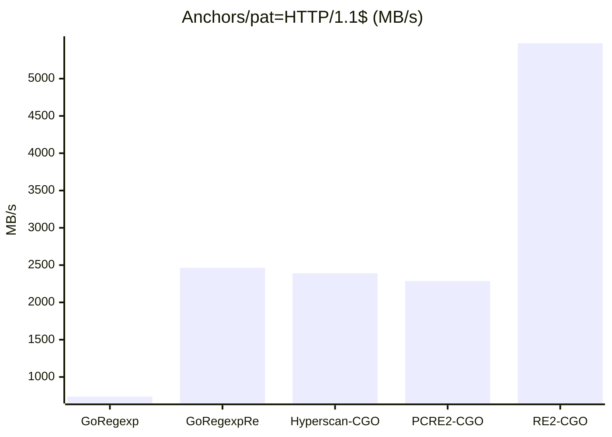
```mermaid
xychart-beta
    title "Anchors/pat=HTTP/1.1$ (MB/s)"
    x-axis ["GoRegexp", "GoRegexpRe", "Hyperscan-CGO", "PCRE2-CGO", "RE2-CGO"]
    y-axis "MB/s"
    bar [737.33, 2463.63, 2390.14, 2286.25, 5475.06]
```

### Anchors/pat=\bGET\b
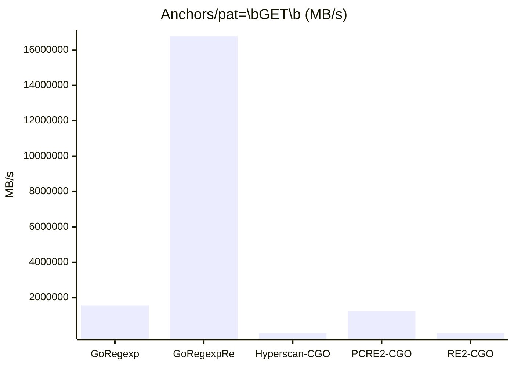
```mermaid
xychart-beta
    title "Anchors/pat=\bGET\b (MB/s)"
    x-axis ["GoRegexp", "GoRegexpRe", "Hyperscan-CGO", "PCRE2-CGO", "RE2-CGO"]
    y-axis "MB/s"
    bar [1557678.85, 16774463.76, 2305.03, 1235062.17, 5376.57]
```

### Anchors/pat=^127.0.0.1
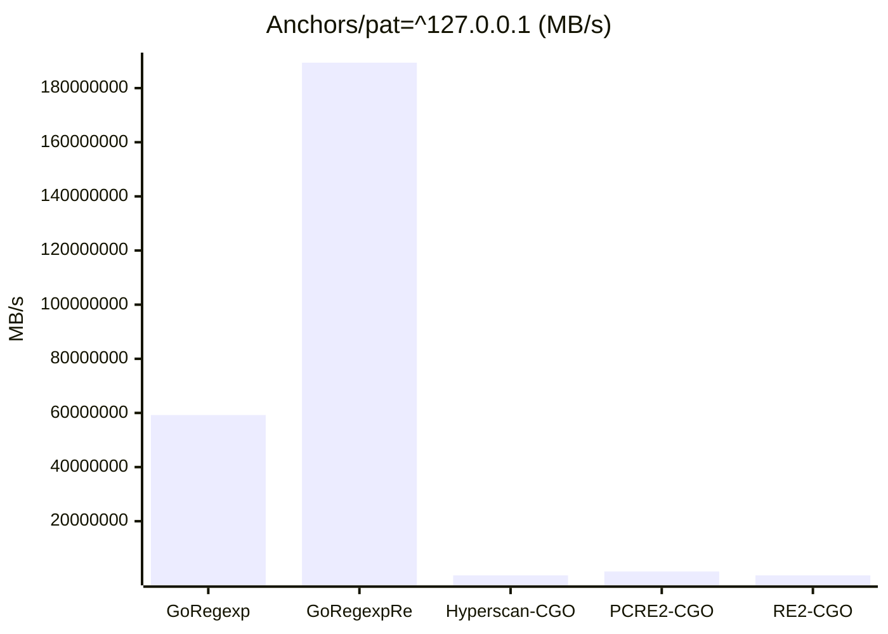
```mermaid
xychart-beta
    title "Anchors/pat=^127.0.0.1 (MB/s)"
    x-axis ["GoRegexp", "GoRegexpRe", "Hyperscan-CGO", "PCRE2-CGO", "RE2-CGO"]
    y-axis "MB/s"
    bar [59225087.81, 189390821.29, 2666.54, 1440715.71, 5348.93]
```

### Capturing/Email
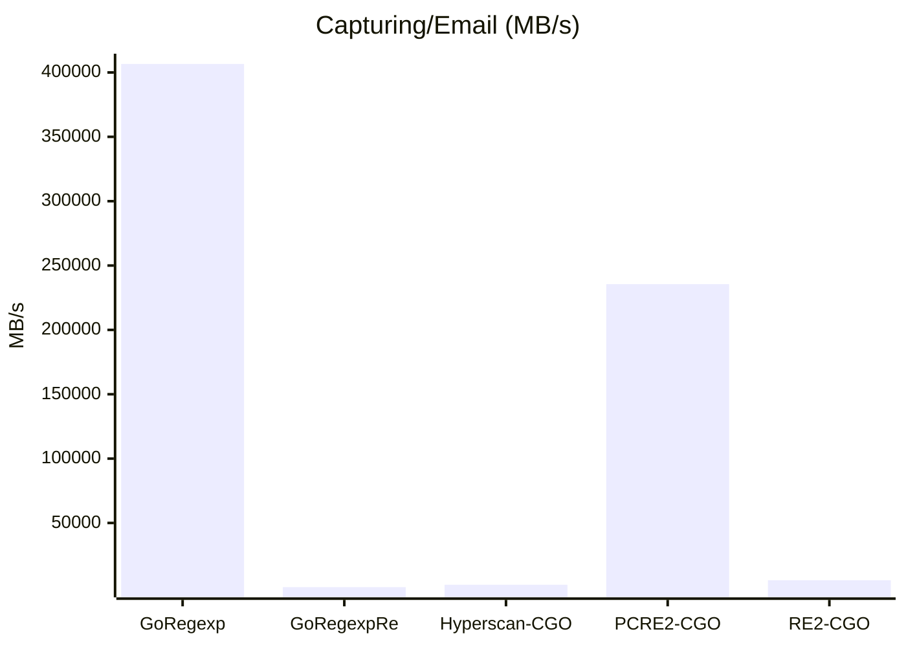
```mermaid
xychart-beta
    title "Capturing/Email (MB/s)"
    x-axis ["GoRegexp", "GoRegexpRe", "Hyperscan-CGO", "PCRE2-CGO", "RE2-CGO"]
    y-axis "MB/s"
    bar [406606.62, 122.91, 1994.12, 235569.18, 5504.94]
```

### Capturing/URI
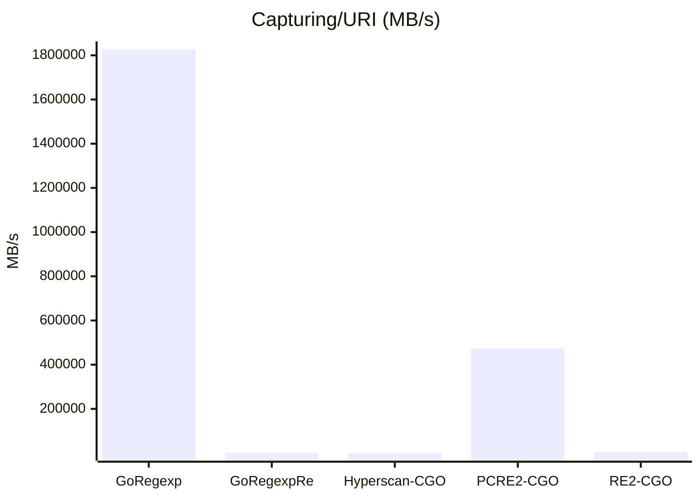
```mermaid
xychart-beta
    title "Capturing/URI (MB/s)"
    x-axis ["GoRegexp", "GoRegexpRe", "Hyperscan-CGO", "PCRE2-CGO", "RE2-CGO"]
    y-axis "MB/s"
    bar [1827032.44, 1589.68, 1038.47, 473124.41, 5464.26]
```

### LargeAlternation/Count=10
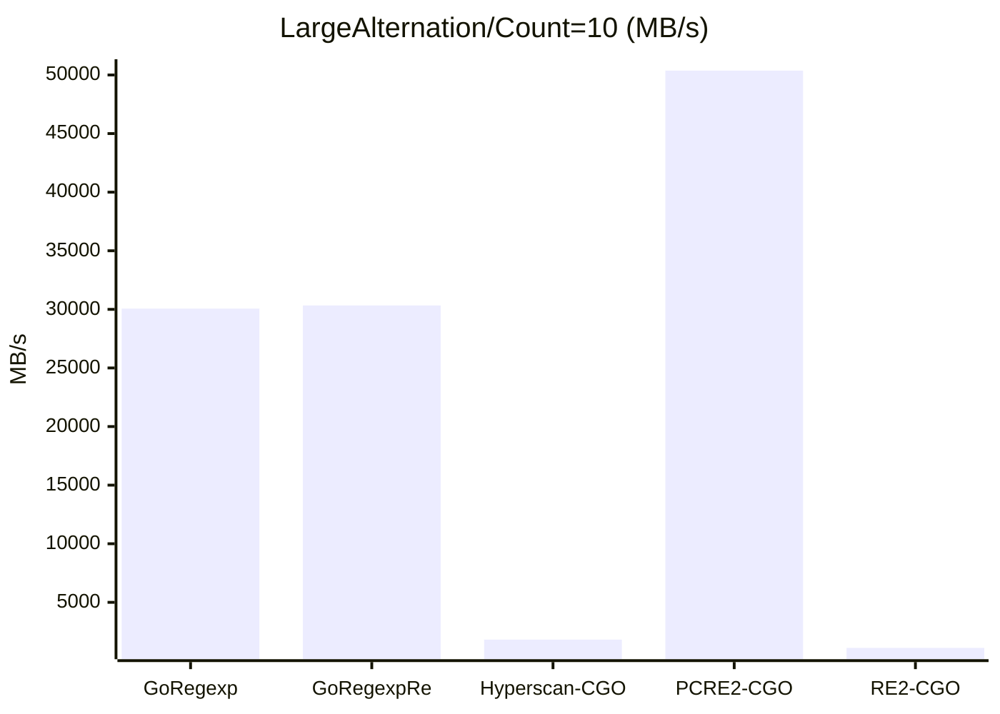
```mermaid
xychart-beta
    title "LargeAlternation/Count=10 (MB/s)"
    x-axis ["GoRegexp", "GoRegexpRe", "Hyperscan-CGO", "PCRE2-CGO", "RE2-CGO"]
    y-axis "MB/s"
    bar [30063.60, 30334.13, 1822.97, 50374.61, 1107.26]
```

### LargeAlternation/Count=100
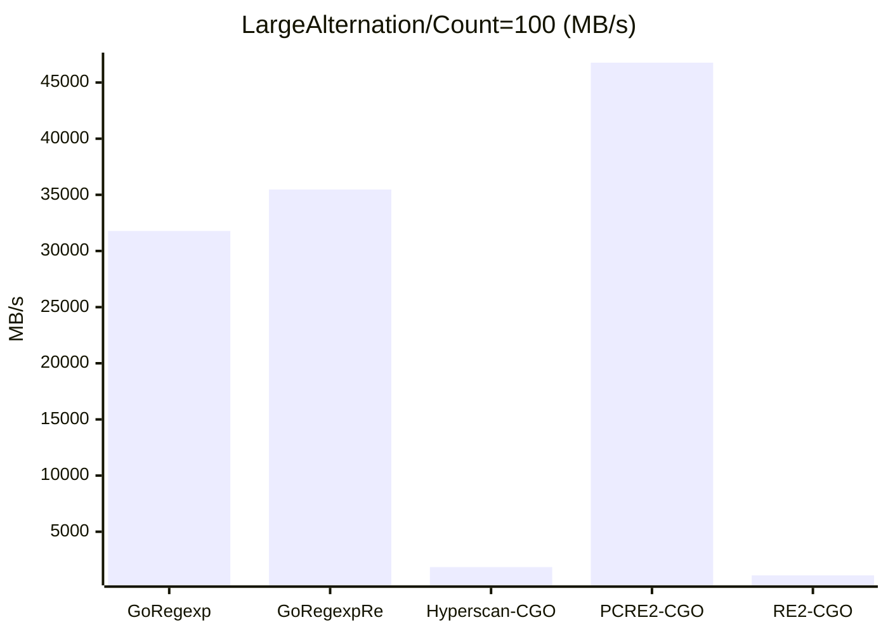
```mermaid
xychart-beta
    title "LargeAlternation/Count=100 (MB/s)"
    x-axis ["GoRegexp", "GoRegexpRe", "Hyperscan-CGO", "PCRE2-CGO", "RE2-CGO"]
    y-axis "MB/s"
    bar [31780.10, 35475.66, 1850.41, 46767.98, 1114.88]
```

### LargeAlternation/Count=1000
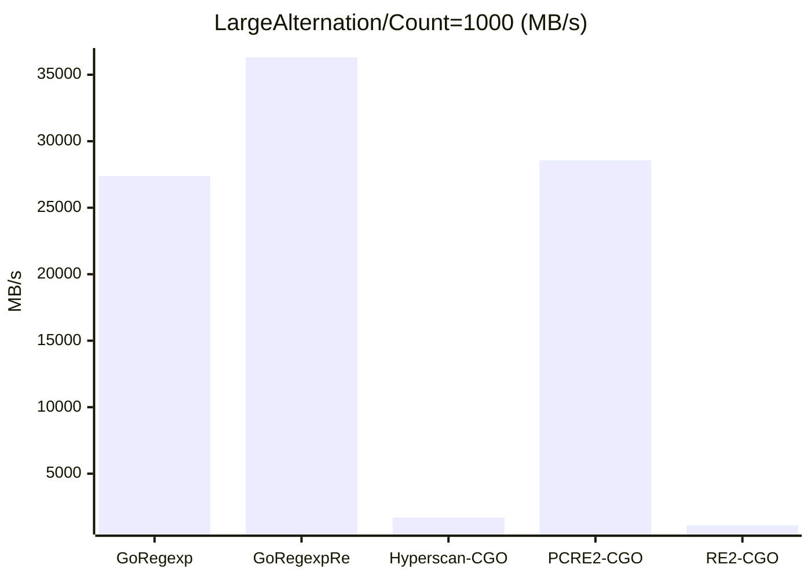
```mermaid
xychart-beta
    title "LargeAlternation/Count=1000 (MB/s)"
    x-axis ["GoRegexp", "GoRegexpRe", "Hyperscan-CGO", "PCRE2-CGO", "RE2-CGO"]
    y-axis "MB/s"
    bar [27377.43, 36315.60, 1703.87, 28563.57, 1107.40]
```

### LargeAlternation/Count=10000
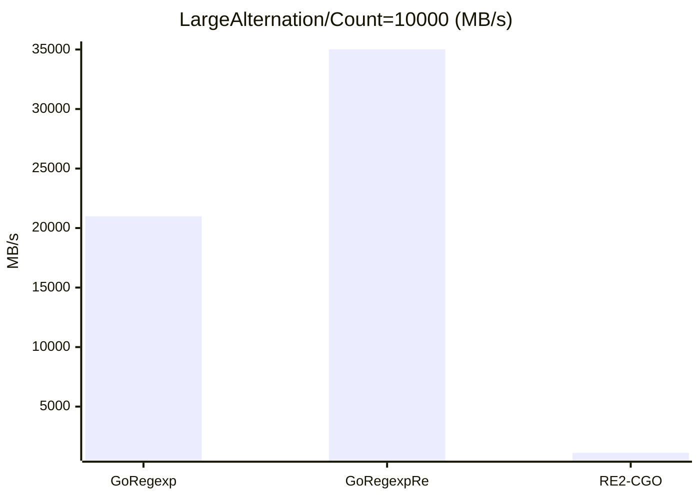
```mermaid
xychart-beta
    title "LargeAlternation/Count=10000 (MB/s)"
    x-axis ["GoRegexp", "GoRegexpRe", "RE2-CGO"]
    y-axis "MB/s"
    bar [20990.72, 35014.87, 1114.71]
```

### LiteralScan/pat=Sherlock
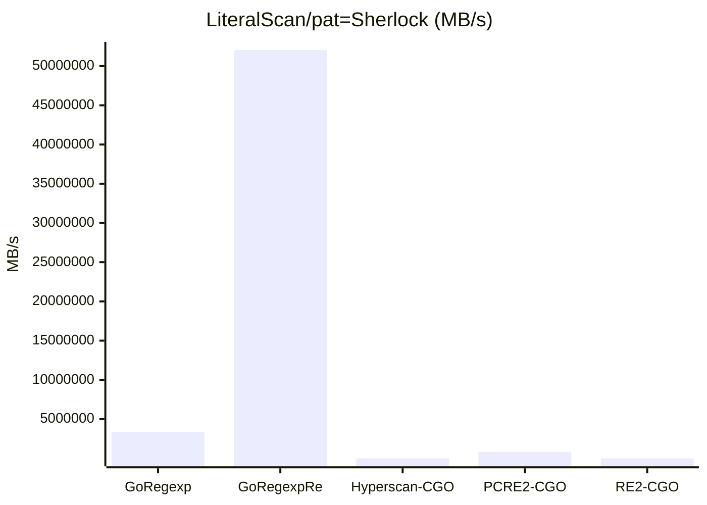
```mermaid
xychart-beta
    title "LiteralScan/pat=Sherlock (MB/s)"
    x-axis ["GoRegexp", "GoRegexpRe", "Hyperscan-CGO", "PCRE2-CGO", "RE2-CGO"]
    y-axis "MB/s"
    bar [3366579.63, 52060191.31, 1993.90, 826419.82, 5658.76]
```

### LiteralScan/pat=The_Adventure_of_the_Speckled_Band
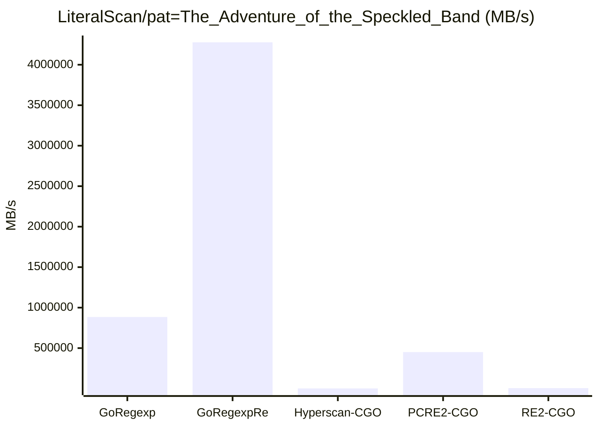
```mermaid
xychart-beta
    title "LiteralScan/pat=The_Adventure_of_the_Speckled_Band (MB/s)"
    x-axis ["GoRegexp", "GoRegexpRe", "Hyperscan-CGO", "PCRE2-CGO", "RE2-CGO"]
    y-axis "MB/s"
    bar [884306.12, 4276994.38, 2212.45, 450339.55, 5507.01]
```

### NFAWorstCase
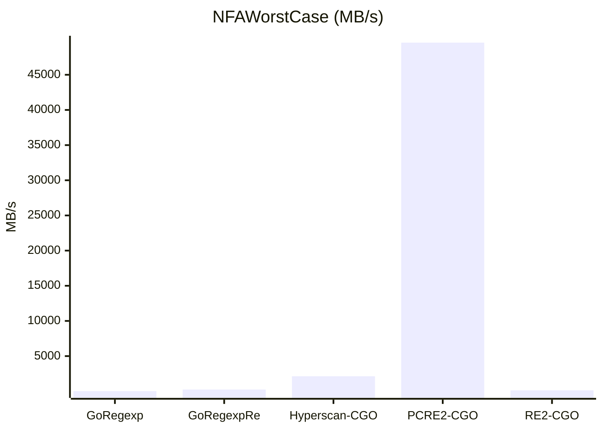
```mermaid
xychart-beta
    title "NFAWorstCase (MB/s)"
    x-axis ["GoRegexp", "GoRegexpRe", "Hyperscan-CGO", "PCRE2-CGO", "RE2-CGO"]
    y-axis "MB/s"
    bar [19.52, 248.40, 2133.36, 49573.79, 138.59]
```

### StandardSuite/Alternation/(fo|foo)
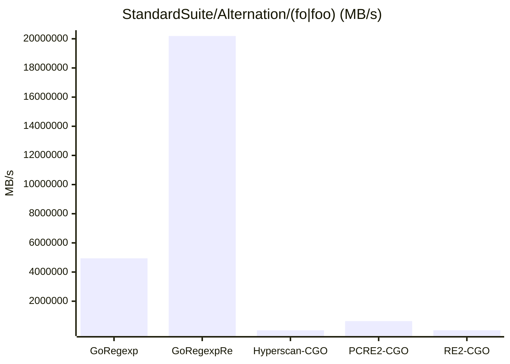
```mermaid
xychart-beta
    title "StandardSuite/Alternation/(fo|foo) (MB/s)"
    x-axis ["GoRegexp", "GoRegexpRe", "Hyperscan-CGO", "PCRE2-CGO", "RE2-CGO"]
    y-axis "MB/s"
    bar [4944287.59, 20192671.40, 1824.50, 633304.30, 5763.90]
```

### StandardSuite/Anchored/^(?:a)$
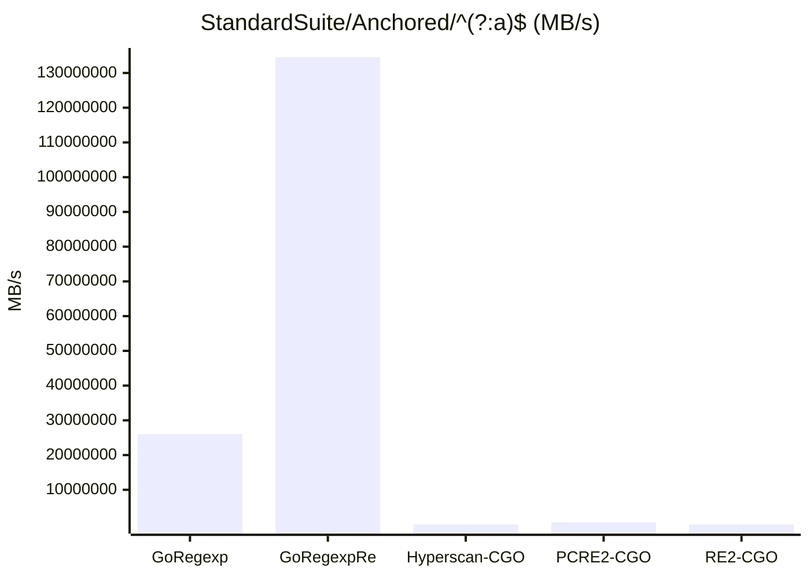
```mermaid
xychart-beta
    title "StandardSuite/Anchored/^(?:a)$ (MB/s)"
    x-axis ["GoRegexp", "GoRegexpRe", "Hyperscan-CGO", "PCRE2-CGO", "RE2-CGO"]
    y-axis "MB/s"
    bar [26063592.55, 134558601.39, 2087.55, 676789.70, 5681.63]
```

### StandardSuite/CharClass/(?i)[@-A]+
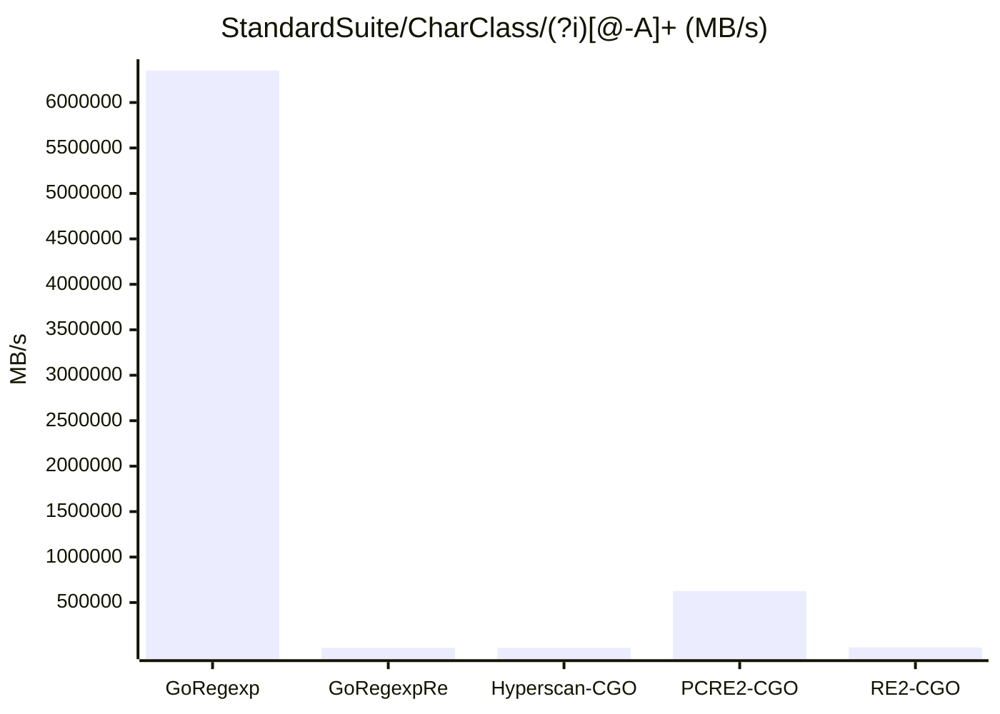
```mermaid
xychart-beta
    title "StandardSuite/CharClass/(?i)[@-A]+ (MB/s)"
    x-axis ["GoRegexp", "GoRegexpRe", "Hyperscan-CGO", "PCRE2-CGO", "RE2-CGO"]
    y-axis "MB/s"
    bar [6351232.22, 198.96, 1841.02, 626865.69, 5680.99]
```

### StandardSuite/Complex/a+
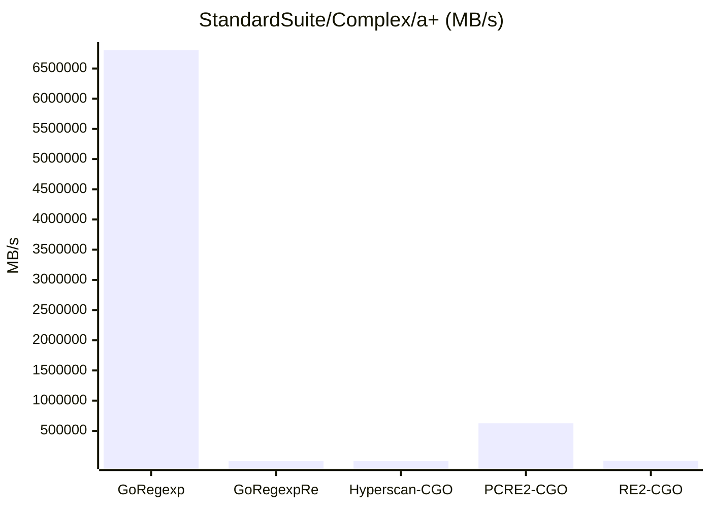
```mermaid
xychart-beta
    title "StandardSuite/Complex/a+ (MB/s)"
    x-axis ["GoRegexp", "GoRegexpRe", "Hyperscan-CGO", "PCRE2-CGO", "RE2-CGO"]
    y-axis "MB/s"
    bar [6802745.70, 508.24, 2092.60, 625292.56, 5690.99]
```

### StandardSuite/Literal/a
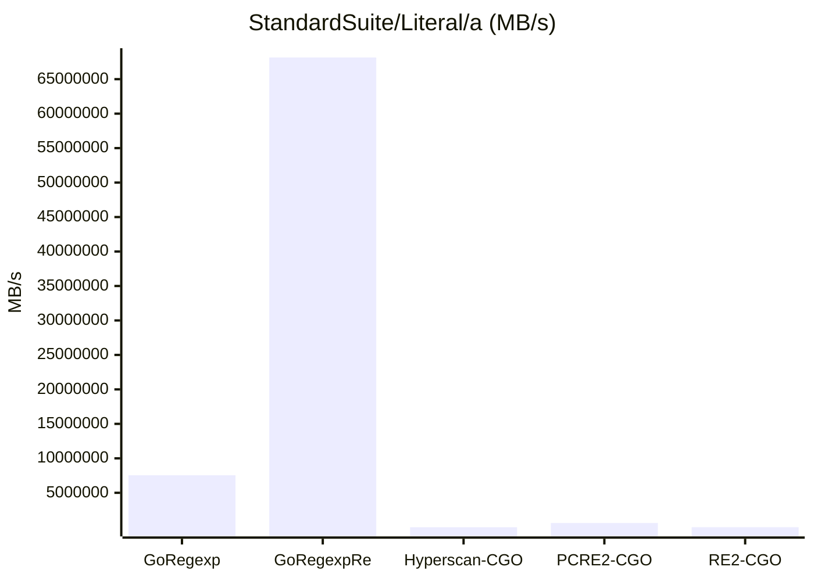
```mermaid
xychart-beta
    title "StandardSuite/Literal/a (MB/s)"
    x-axis ["GoRegexp", "GoRegexpRe", "Hyperscan-CGO", "PCRE2-CGO", "RE2-CGO"]
    y-axis "MB/s"
    bar [7545469.07, 68152350.88, 1766.90, 619834.64, 5661.18]
```

### Synthetic/CCWarp
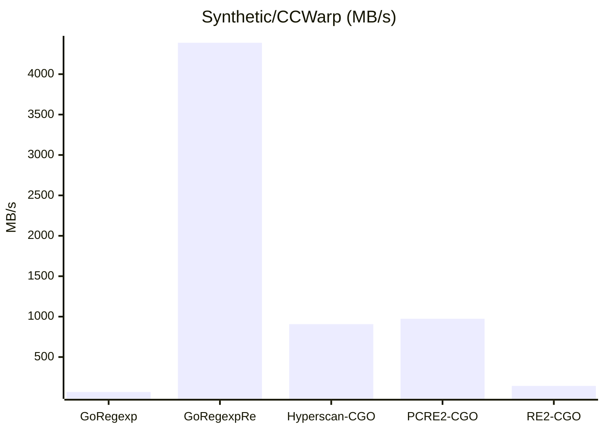
```mermaid
xychart-beta
    title "Synthetic/CCWarp (MB/s)"
    x-axis ["GoRegexp", "GoRegexpRe", "Hyperscan-CGO", "PCRE2-CGO", "RE2-CGO"]
    y-axis "MB/s"
    bar [66.99, 4389.04, 906.89, 973.93, 142.69]
```

### Synthetic/PureDFA
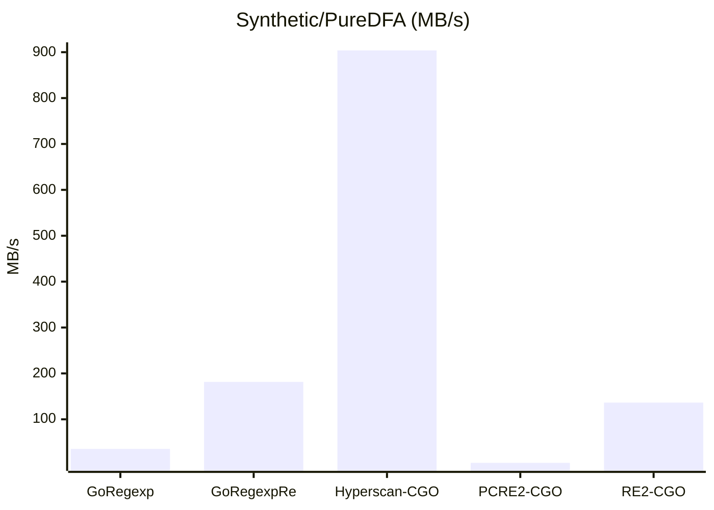
```mermaid
xychart-beta
    title "Synthetic/PureDFA (MB/s)"
    x-axis ["GoRegexp", "GoRegexpRe", "Hyperscan-CGO", "PCRE2-CGO", "RE2-CGO"]
    y-axis "MB/s"
    bar [35.43, 181.55, 903.85, 5.19, 136.41]
```

### Synthetic/SIMDWarp
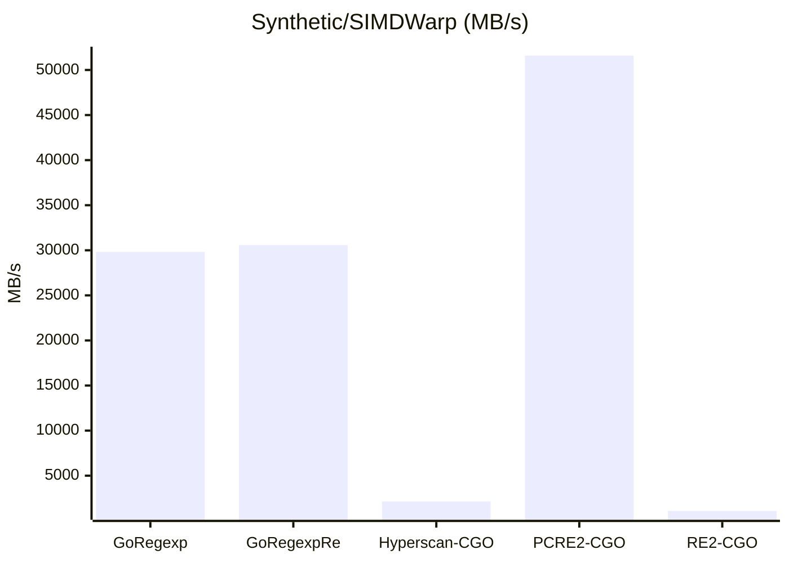
```mermaid
xychart-beta
    title "Synthetic/SIMDWarp (MB/s)"
    x-axis ["GoRegexp", "GoRegexpRe", "Hyperscan-CGO", "PCRE2-CGO", "RE2-CGO"]
    y-axis "MB/s"
    bar [29821.21, 30584.13, 2147.12, 51588.93, 1090.11]
```

### Synthetic/SearchWarp
```mermaid
xychart-beta
    title "Synthetic/SearchWarp (MB/s)"
    x-axis ["GoRegexp", "GoRegexpRe", "Hyperscan-CGO", "PCRE2-CGO", "RE2-CGO"]
    y-axis "MB/s"
    bar [42.27, 550.26, 2637.63, 1227.83, 141.13]
```
