## Benchmark Comparison (Average ns/op)
| Test Case | GoRegexp | GoRegexpRe | Coregex | Hyperscan-CGO | PCRE2-CGO | RE2-CGO |
|---|---|---|---|---|---|---|
| Anchors/pat=(?m)HTTP/1.1$ | 3256194.00 | 104028511.80 | 1438345.00 | 2113064.60 | 1051089.00 | 3506816.60 |
| Anchors/pat=(?m)^127.0.0.1 | 40250573.40 | 21562819.00 | 377378.00 | 1253336.80 | 4917335.00 | 17411766.20 |
| Anchors/pat=HTTP/1.1$ | 3308236.40 | 26.54 | 39.40 | 1111895.60 | 1045368.60 | 439865.40 |
| Anchors/pat=\bGET\b | 1507.60 | 66.94 | 199.54 | 1024986.40 | 1897.80 | 437640.00 |
| Anchors/pat=^127.0.0.1 | 41.08 | 26.33 | 5.87 | 1000758.40 | 1647.00 | 494716.00 |
| Capturing/Email | 2599.00 | 1314.20 | 5151.20 | 491767.00 | 2756.60 | 194721.00 |
| Capturing/URI | 576.38 | 85.38 | 4104703.20 | 450131.60 | 1929.00 | 195466.60 |
| Landscape/S=0.01/B=1/L=0.10 | 233135.60 | 236796.80 | 4257454.00 | 490711.00 | 21252.80 | 1321999.20 |
| Landscape/S=0.01/B=1/L=0.90 | 71955.20 | 69866.40 | 4250041.00 | 475542.00 | 21375.80 | 1063299.20 |
| Landscape/S=0.01/B=10/L=0.10 | 233576.20 | 236136.80 | 159133.20 | 516226.60 | 2018705.00 | 1315021.20 |
| Landscape/S=0.01/B=10/L=0.90 | 70508.60 | 69750.60 | 158896.40 | 507376.80 | 1889919.80 | 1089523.60 |
| Landscape/S=0.01/B=50/L=0.10 | 233731.20 | 235500.20 | 119742.60 | 496953.80 | 7643102.60 | 1382416.20 |
| Landscape/S=0.01/B=50/L=0.90 | 70365.00 | 69556.60 | 119607.60 | 480967.80 | 7614993.00 | 1068804.80 |
| Landscape/S=0.10/B=1/L=0.10 | 1125893.80 | 1150937.00 | 4244477.20 | 522455.20 | 22234.60 | 4243139.00 |
| Landscape/S=0.10/B=1/L=0.90 | 121734.80 | 121768.60 | 4242949.80 | 513398.00 | 22883.00 | 2326765.20 |
| Landscape/S=0.10/B=10/L=0.10 | 1427024.20 | 1474928.20 | 284533.20 | 508429.00 | 17584624.40 | 4235124.60 |
| Landscape/S=0.10/B=10/L=0.90 | 121592.20 | 124635.40 | 160295.40 | 519224.00 | 17600654.20 | 2102006.40 |
| Landscape/S=0.10/B=50/L=0.10 | 1120282.40 | 1151452.80 | 119910.80 | 523271.80 | 72309450.60 | 4279544.40 |
| Landscape/S=0.10/B=50/L=0.90 | 122076.00 | 122072.20 | 119968.80 | 530127.60 | 71356242.00 | 2100662.80 |
| Landscape/S=0.50/B=1/L=0.10 | 121906.40 | 122448.80 | 4247316.00 | 529367.60 | 21755.40 | 10008540.80 |
| Landscape/S=0.50/B=1/L=0.90 | 122258.00 | 121835.00 | 4257136.60 | 488528.20 | 22389.80 | 5535081.60 |
| Landscape/S=0.50/B=10/L=0.10 | 122128.60 | 122284.60 | 159564.20 | 699845.60 | 70223220.20 | 10036787.20 |
| Landscape/S=0.50/B=10/L=0.90 | 122377.60 | 123062.20 | 159374.60 | 725113.60 | 70069642.60 | 5462123.20 |
| Landscape/S=0.50/B=50/L=0.10 | 121729.60 | 122085.20 | 119930.80 | 718813.40 | 290800343.60 | 10027132.80 |
| Landscape/S=0.50/B=50/L=0.90 | 122431.00 | 121894.00 | 120122.20 | 746486.40 | 290370987.40 | 5465801.20 |
| Landscape/S=0.90/B=1/L=0.10 | 123979.00 | 121930.40 | 4240561.00 | 551381.00 | 21075.20 | 11458744.60 |
| Landscape/S=0.90/B=1/L=0.90 | 122368.80 | 121647.80 | 4232583.80 | 542530.60 | 21730.40 | 7322315.80 |
| Landscape/S=0.90/B=10/L=0.10 | 122400.00 | 122205.60 | 159128.00 | 763661.00 | 104976960.00 | 11403292.00 |
| Landscape/S=0.90/B=10/L=0.90 | 123489.60 | 121774.20 | 159240.80 | 798146.40 | 106590962.40 | 7305191.60 |
| Landscape/S=0.90/B=50/L=0.10 | 122604.20 | 121578.00 | 121248.60 | 768343.80 | 817589984.40 | 16474546.80 |
| Landscape/S=0.90/B=50/L=0.90 | 122837.80 | 121887.00 | 164772.40 | 783083.40 | 442383576.00 | 7303212.20 |
| LargeAlternation/Count=10 | 35730.20 | 31175.20 | 158923.20 | 677582.00 | 22484.60 | 943564.60 |
| LargeAlternation/Count=100 | 32198.60 | 31897.00 | 162165.20 | 630878.80 | 23634.80 | 941344.40 |
| LargeAlternation/Count=1000 | 40864.20 | 30346.40 | 167589.00 | 623450.40 | 38865.20 | 944824.80 |
| LargeAlternation/Count=10000 | 52580.80 | 30136.80 | 19092068.80 | N/A | N/A | 963737.00 |
| LiteralScan/pat=Sherlock | 369.28 | 30.67 | 192.58 | 600140.40 | 1569.00 | 223761.40 |
| LiteralScan/pat=The_Adventure_of_the_Speckled_Band | 1380.40 | 286.66 | 452.16 | 530246.00 | 2911.20 | 238473.60 |
| NFAWorstCase/Run | 53357066.40 | 68215567.60 | 4254440.40 | 541796.20 | 24253.00 | 7699492.00 |
| StandardSuite/Alternation/(fo\|foo) | 213.96 | 41.21 | 85.44 | 574770.60 | 2117.00 | 186556.40 |
| StandardSuite/Anchored/^(?:a)$ | 40.83 | 17.45 | 5.73 | 502275.00 | 3086.60 | 185923.80 |
| StandardSuite/CharClass/(?i)[@-A]+ | 167.56 | 51.69 | 12.05 | 527080.40 | 3080.80 | 187096.20 |
| StandardSuite/Complex/a+ | 154.80 | 53.78 | 83.65 | 471475.40 | 2043.40 | 187438.40 |
| StandardSuite/Literal/a | 135.94 | 22.14 | 84.41 | 549936.00 | 1742.00 | 189241.20 |
| Synthetic/CCWarp | 15634027.80 | 218315.00 | 72335346.40 | 1212502.00 | 1080749.40 | 7368445.40 |
| Synthetic/PureDFA | 30294286.40 | 3983437.00 | 177103923.00 | 1195572.40 | 203887704.40 | 7391816.00 |
| Synthetic/SIMDWarp | 35456.20 | 35996.00 | 29623.80 | 566006.20 | 21140.00 | 1007073.80 |
| Synthetic/SearchWarp | 24852849.60 | 277117.00 | 1405605.20 | 422174.40 | 851880.20 | 7485080.00 |

## Throughput Comparison (Average MB/s)
| Test Case | GoRegexp | GoRegexpRe | Coregex | Hyperscan-CGO | PCRE2-CGO | RE2-CGO |
|---|---|---|---|---|---|---|
| Anchors/pat=(?m)HTTP/1.1$ | 728.09 | 22.79 | 1648.28 | 1122.06 | 2255.62 | 676.09 |
| Anchors/pat=(?m)^127.0.0.1 | 58.90 | 109.95 | 6285.16 | 1895.21 | 482.17 | 136.16 |
| Anchors/pat=HTTP/1.1$ | 717.14 | 89352090.70 | 60188130.72 | 2147.39 | 2267.96 | 5389.98 |
| Anchors/pat=\bGET\b | 1572433.02 | 35414622.89 | 11879971.17 | 2314.36 | 1249753.43 | 5423.44 |
| Anchors/pat=^127.0.0.1 | 57721349.19 | 90055446.87 | 403825534.95 | 2385.64 | 1440371.94 | 4889.20 |
| Capturing/Email | 403474.44 | 797909.20 | 203578.36 | 2133.28 | 380432.44 | 5385.81 |
| Capturing/URI | 1819371.55 | 12281158.58 | 255.48 | 2331.34 | 543603.74 | 5365.42 |
| Landscape/S=0.01/B=1/L=0.10 | 4497.73 | 4428.65 | 246.30 | 2143.19 | 49349.46 | 793.37 |
| Landscape/S=0.01/B=1/L=0.90 | 14581.16 | 15008.77 | 246.72 | 2205.77 | 49150.75 | 986.21 |
| Landscape/S=0.01/B=10/L=0.10 | 4489.23 | 4440.59 | 6589.39 | 2036.17 | 519.44 | 797.43 |
| Landscape/S=0.01/B=10/L=0.90 | 14871.90 | 15033.37 | 6599.16 | 2068.25 | 554.84 | 963.14 |
| Landscape/S=0.01/B=50/L=0.10 | 4486.30 | 4452.59 | 8757.00 | 2113.03 | 137.19 | 758.55 |
| Landscape/S=0.01/B=50/L=0.90 | 14902.40 | 15075.39 | 8766.85 | 2181.38 | 137.71 | 981.17 |
| Landscape/S=0.10/B=1/L=0.10 | 931.39 | 911.06 | 247.04 | 2009.74 | 47257.16 | 247.12 |
| Landscape/S=0.10/B=1/L=0.90 | 8613.61 | 8611.26 | 247.14 | 2044.60 | 45830.20 | 465.55 |
| Landscape/S=0.10/B=10/L=0.10 | 735.25 | 711.11 | 3701.58 | 2062.59 | 59.64 | 247.60 |
| Landscape/S=0.10/B=10/L=0.90 | 8623.77 | 8420.15 | 6541.68 | 2020.39 | 59.60 | 498.85 |
| Landscape/S=0.10/B=50/L=0.10 | 935.99 | 910.66 | 8744.66 | 2008.00 | 14.50 | 245.19 |
| Landscape/S=0.10/B=50/L=0.90 | 8589.62 | 8589.90 | 8740.46 | 1983.04 | 14.69 | 499.17 |
| Landscape/S=0.50/B=1/L=0.10 | 8601.51 | 8563.86 | 246.88 | 1981.90 | 48338.68 | 104.77 |
| Landscape/S=0.50/B=1/L=0.90 | 8576.81 | 8606.58 | 246.31 | 2147.60 | 46872.55 | 189.58 |
| Landscape/S=0.50/B=10/L=0.10 | 8585.92 | 8574.97 | 6571.68 | 1499.35 | 14.93 | 104.47 |
| Landscape/S=0.50/B=10/L=0.90 | 8568.40 | 8523.79 | 6579.42 | 1447.33 | 14.97 | 191.97 |
| Landscape/S=0.50/B=50/L=0.10 | 8614.03 | 8588.96 | 8743.27 | 1462.44 | 3.61 | 104.57 |
| Landscape/S=0.50/B=50/L=0.90 | 8564.87 | 8602.44 | 8729.50 | 1405.09 | 3.61 | 191.85 |
| Landscape/S=0.90/B=1/L=0.10 | 8462.18 | 8599.87 | 247.28 | 1901.83 | 49948.66 | 91.52 |
| Landscape/S=0.90/B=1/L=0.90 | 8569.10 | 8619.90 | 247.74 | 1933.33 | 48266.97 | 143.20 |
| Landscape/S=0.90/B=10/L=0.10 | 8566.86 | 8580.53 | 6589.57 | 1373.28 | 9.99 | 91.96 |
| Landscape/S=0.90/B=10/L=0.90 | 8492.99 | 8610.90 | 6584.89 | 1314.52 | 9.84 | 143.54 |
| Landscape/S=0.90/B=50/L=0.10 | 8552.55 | 8624.73 | 8650.25 | 1364.95 | 1.29 | 63.86 |
| Landscape/S=0.90/B=50/L=0.90 | 8536.56 | 8602.90 | 6524.65 | 1339.09 | 2.37 | 143.58 |
| LargeAlternation/Count=10 | 29372.17 | 33780.08 | 6598.49 | 1550.34 | 46686.56 | 1111.46 |
| LargeAlternation/Count=100 | 32651.25 | 32962.52 | 6466.41 | 1662.54 | 44392.41 | 1114.07 |
| LargeAlternation/Count=1000 | 25745.54 | 34592.74 | 6257.12 | 1682.71 | 27003.41 | 1109.86 |
| LargeAlternation/Count=10000 | 19995.14 | 34821.23 | 54.94 | N/A | N/A | 1089.02 |
| LiteralScan/pat=Sherlock | 3291325.88 | 39613896.48 | 6309110.30 | 2032.03 | 775823.10 | 5435.00 |
| LiteralScan/pat=The_Adventure_of_the_Speckled_Band | 880237.35 | 4239833.19 | 2687226.52 | 2292.93 | 417406.72 | 5097.06 |
| NFAWorstCase/Run | 19.65 | 15.37 | 246.47 | 1935.83 | 43258.16 | 136.22 |
| StandardSuite/Alternation/(fo\|foo) | 4900671.30 | 25448439.11 | 12272969.83 | 1825.53 | 534892.93 | 5621.14 |
| StandardSuite/Anchored/^(?:a)$ | 25683016.90 | 60110275.92 | 182966975.35 | 2089.30 | 340567.42 | 5640.86 |
| StandardSuite/CharClass/(?i)[@-A]+ | 6257752.81 | 20285852.11 | 87035331.22 | 1991.05 | 340962.75 | 5606.38 |
| StandardSuite/Complex/a+ | 6774015.82 | 19497732.12 | 12537952.50 | 2224.52 | 535130.87 | 5595.08 |
| StandardSuite/Literal/a | 7713265.19 | 47370965.09 | 12425537.30 | 1908.84 | 602069.09 | 5544.44 |
| Synthetic/CCWarp | 67.07 | 4802.96 | 14.85 | 865.74 | 970.22 | 142.30 |
| Synthetic/PureDFA | 34.63 | 263.24 | 5.92 | 877.27 | 5.14 | 141.86 |
| Synthetic/SIMDWarp | 30669.61 | 30225.26 | 36710.60 | 1924.53 | 51448.23 | 1081.36 |
| Synthetic/SearchWarp | 42.22 | 3783.84 | 815.31 | 2484.20 | 1230.92 | 140.09 |

## Performance Graphs (MB/s, higher is better)

### Anchors/pat=(?m)HTTP/1.1$
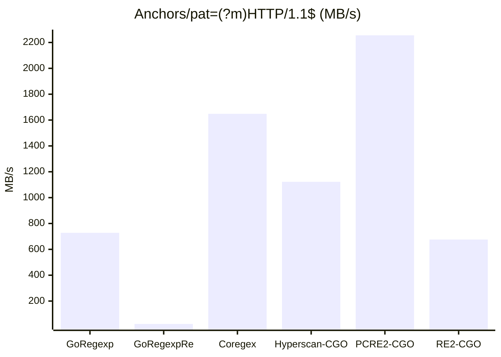
```mermaid
xychart-beta
    title "Anchors/pat=(?m)HTTP/1.1$ (MB/s)"
    x-axis ["GoRegexp", "GoRegexpRe", "Coregex", "Hyperscan-CGO", "PCRE2-CGO", "RE2-CGO"]
    y-axis "MB/s"
    bar [728.09, 22.79, 1648.28, 1122.06, 2255.62, 676.09]
```

### Anchors/pat=(?m)^127.0.0.1
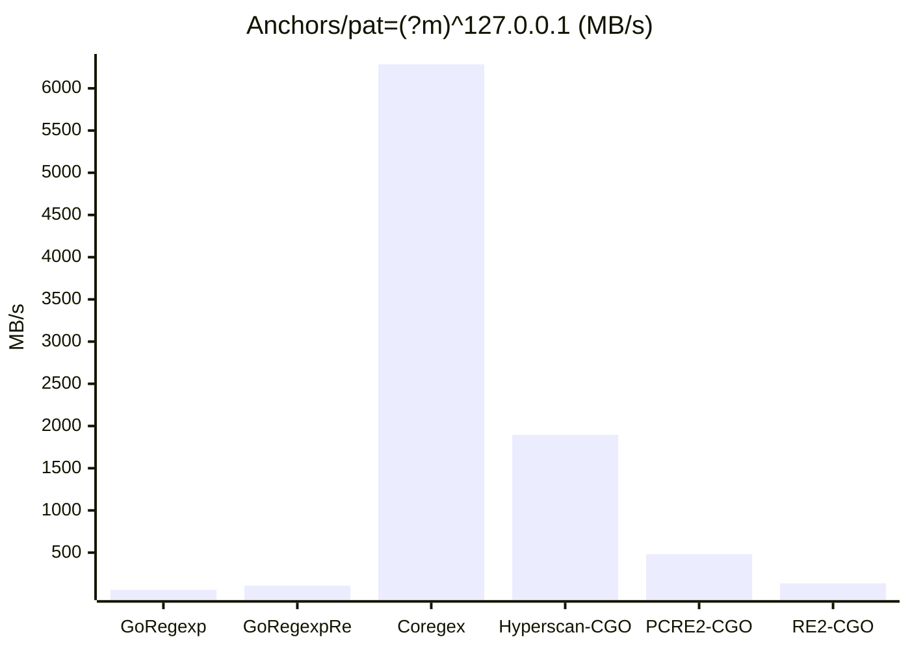
```mermaid
xychart-beta
    title "Anchors/pat=(?m)^127.0.0.1 (MB/s)"
    x-axis ["GoRegexp", "GoRegexpRe", "Coregex", "Hyperscan-CGO", "PCRE2-CGO", "RE2-CGO"]
    y-axis "MB/s"
    bar [58.90, 109.95, 6285.16, 1895.21, 482.17, 136.16]
```

### Anchors/pat=HTTP/1.1$
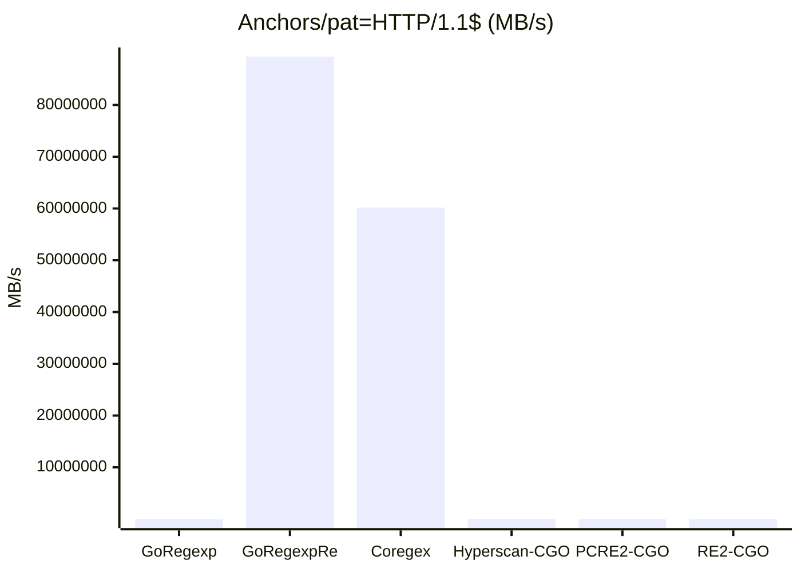
```mermaid
xychart-beta
    title "Anchors/pat=HTTP/1.1$ (MB/s)"
    x-axis ["GoRegexp", "GoRegexpRe", "Coregex", "Hyperscan-CGO", "PCRE2-CGO", "RE2-CGO"]
    y-axis "MB/s"
    bar [717.14, 89352090.70, 60188130.72, 2147.39, 2267.96, 5389.98]
```

### Anchors/pat=\bGET\b
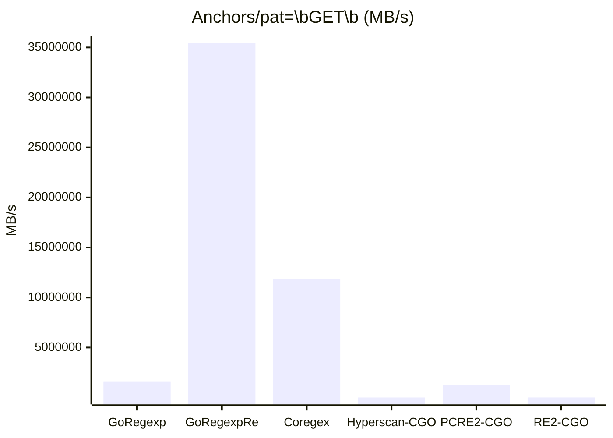
```mermaid
xychart-beta
    title "Anchors/pat=\bGET\b (MB/s)"
    x-axis ["GoRegexp", "GoRegexpRe", "Coregex", "Hyperscan-CGO", "PCRE2-CGO", "RE2-CGO"]
    y-axis "MB/s"
    bar [1572433.02, 35414622.89, 11879971.17, 2314.36, 1249753.43, 5423.44]
```

### Anchors/pat=^127.0.0.1
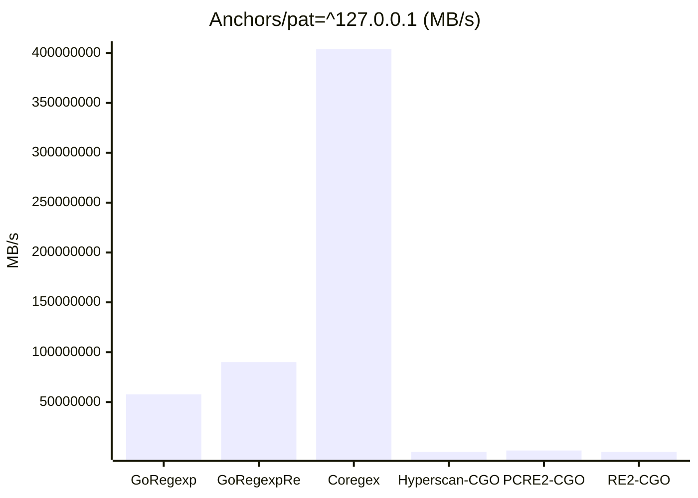
```mermaid
xychart-beta
    title "Anchors/pat=^127.0.0.1 (MB/s)"
    x-axis ["GoRegexp", "GoRegexpRe", "Coregex", "Hyperscan-CGO", "PCRE2-CGO", "RE2-CGO"]
    y-axis "MB/s"
    bar [57721349.19, 90055446.87, 403825534.95, 2385.64, 1440371.94, 4889.20]
```

### Capturing/Email
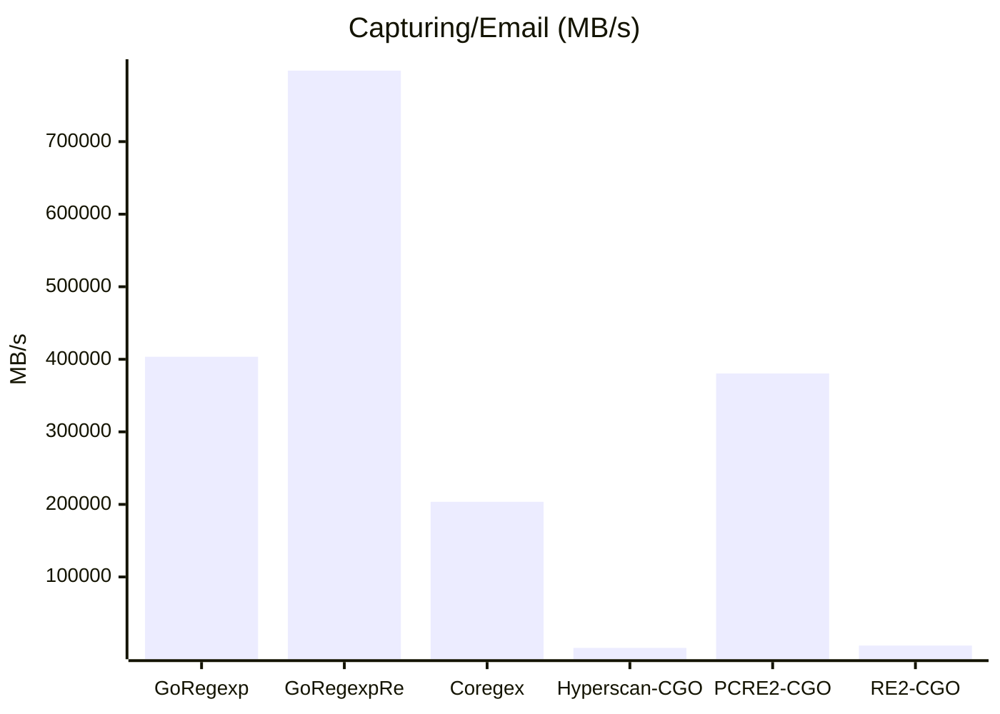
```mermaid
xychart-beta
    title "Capturing/Email (MB/s)"
    x-axis ["GoRegexp", "GoRegexpRe", "Coregex", "Hyperscan-CGO", "PCRE2-CGO", "RE2-CGO"]
    y-axis "MB/s"
    bar [403474.44, 797909.20, 203578.36, 2133.28, 380432.44, 5385.81]
```

### Capturing/URI
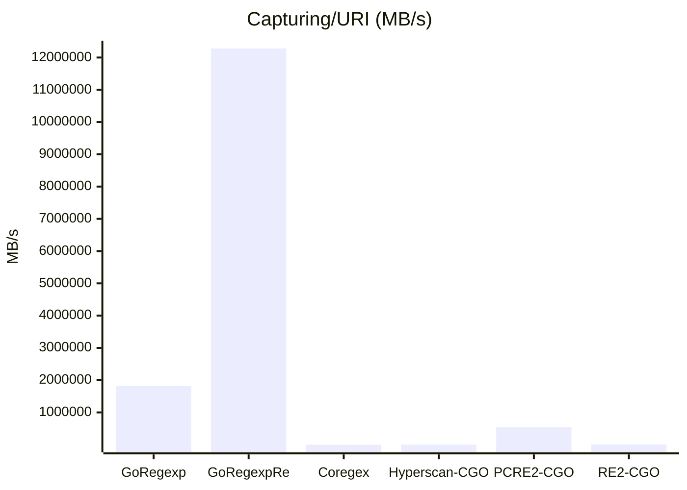
```mermaid
xychart-beta
    title "Capturing/URI (MB/s)"
    x-axis ["GoRegexp", "GoRegexpRe", "Coregex", "Hyperscan-CGO", "PCRE2-CGO", "RE2-CGO"]
    y-axis "MB/s"
    bar [1819371.55, 12281158.58, 255.48, 2331.34, 543603.74, 5365.42]
```

### Landscape/S=0.01/B=1/L=0.10
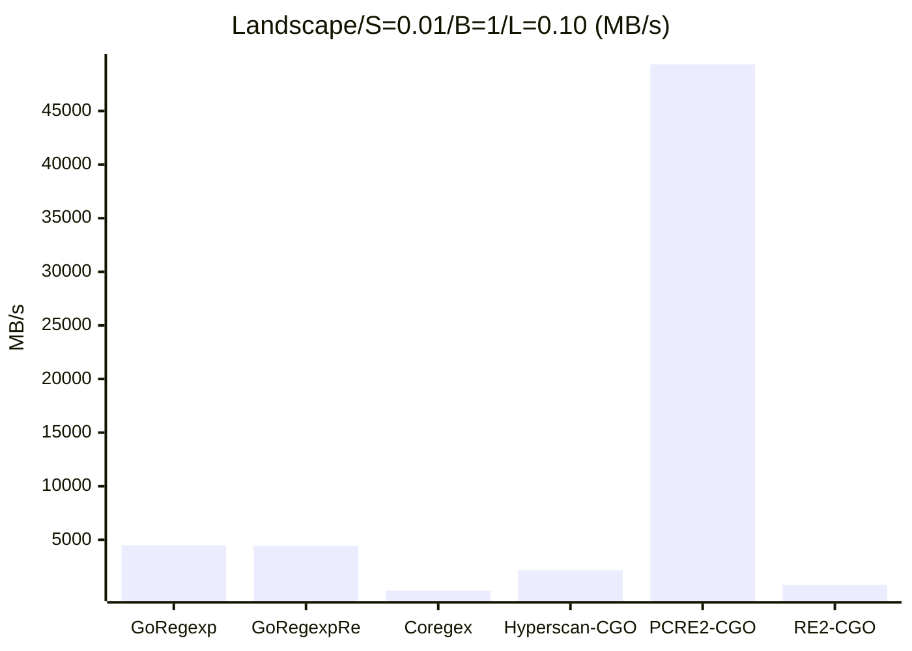
```mermaid
xychart-beta
    title "Landscape/S=0.01/B=1/L=0.10 (MB/s)"
    x-axis ["GoRegexp", "GoRegexpRe", "Coregex", "Hyperscan-CGO", "PCRE2-CGO", "RE2-CGO"]
    y-axis "MB/s"
    bar [4497.73, 4428.65, 246.30, 2143.19, 49349.46, 793.37]
```

### Landscape/S=0.01/B=1/L=0.90
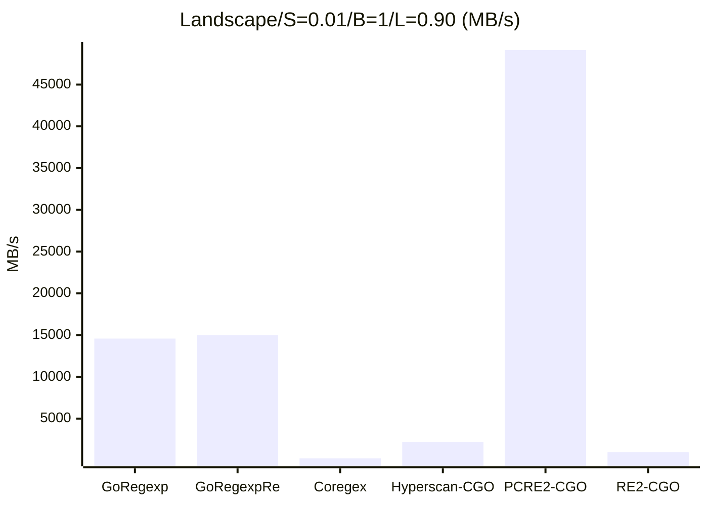
```mermaid
xychart-beta
    title "Landscape/S=0.01/B=1/L=0.90 (MB/s)"
    x-axis ["GoRegexp", "GoRegexpRe", "Coregex", "Hyperscan-CGO", "PCRE2-CGO", "RE2-CGO"]
    y-axis "MB/s"
    bar [14581.16, 15008.77, 246.72, 2205.77, 49150.75, 986.21]
```

### Landscape/S=0.01/B=10/L=0.10
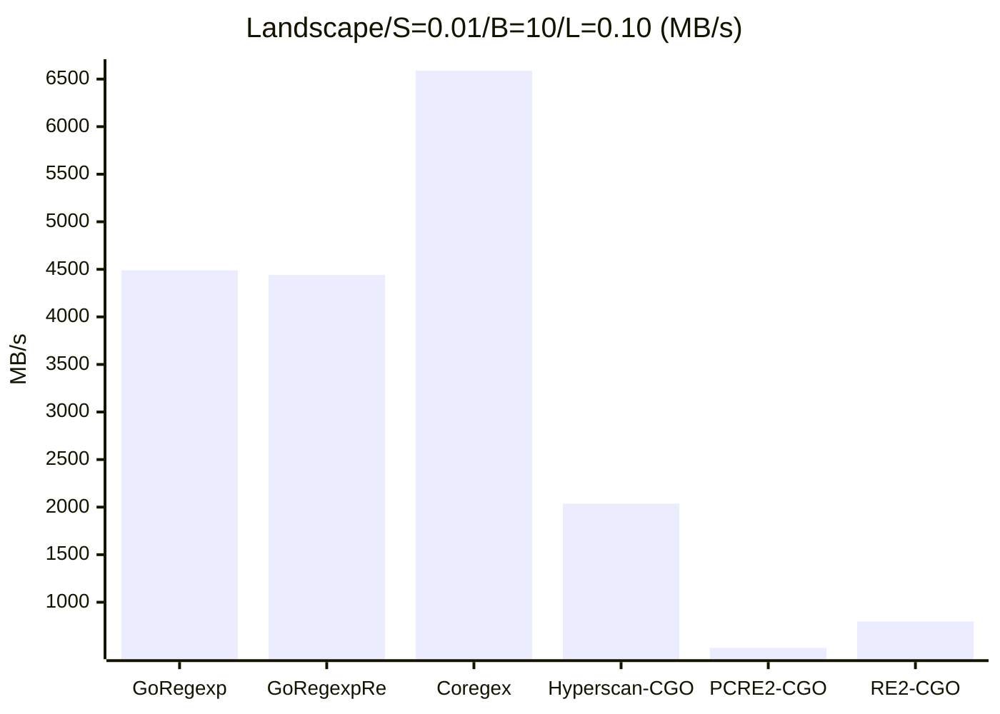
```mermaid
xychart-beta
    title "Landscape/S=0.01/B=10/L=0.10 (MB/s)"
    x-axis ["GoRegexp", "GoRegexpRe", "Coregex", "Hyperscan-CGO", "PCRE2-CGO", "RE2-CGO"]
    y-axis "MB/s"
    bar [4489.23, 4440.59, 6589.39, 2036.17, 519.44, 797.43]
```

### Landscape/S=0.01/B=10/L=0.90
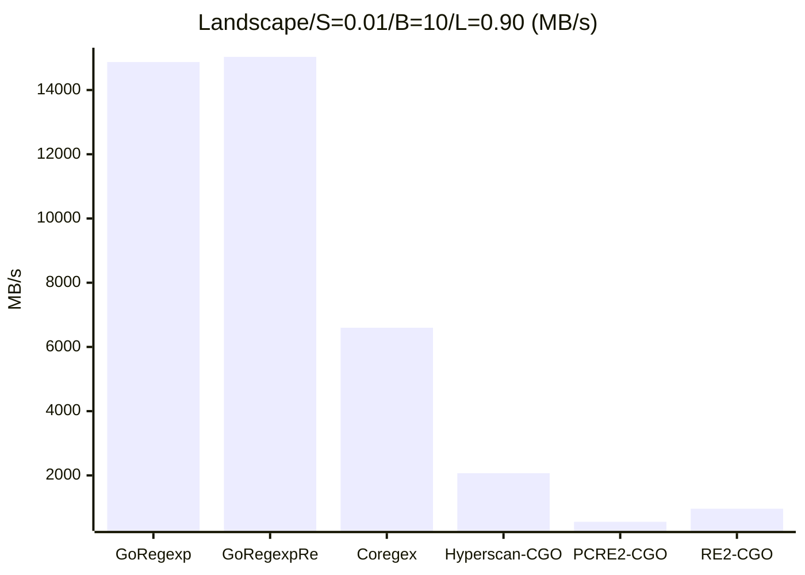
```mermaid
xychart-beta
    title "Landscape/S=0.01/B=10/L=0.90 (MB/s)"
    x-axis ["GoRegexp", "GoRegexpRe", "Coregex", "Hyperscan-CGO", "PCRE2-CGO", "RE2-CGO"]
    y-axis "MB/s"
    bar [14871.90, 15033.37, 6599.16, 2068.25, 554.84, 963.14]
```

### Landscape/S=0.01/B=50/L=0.10
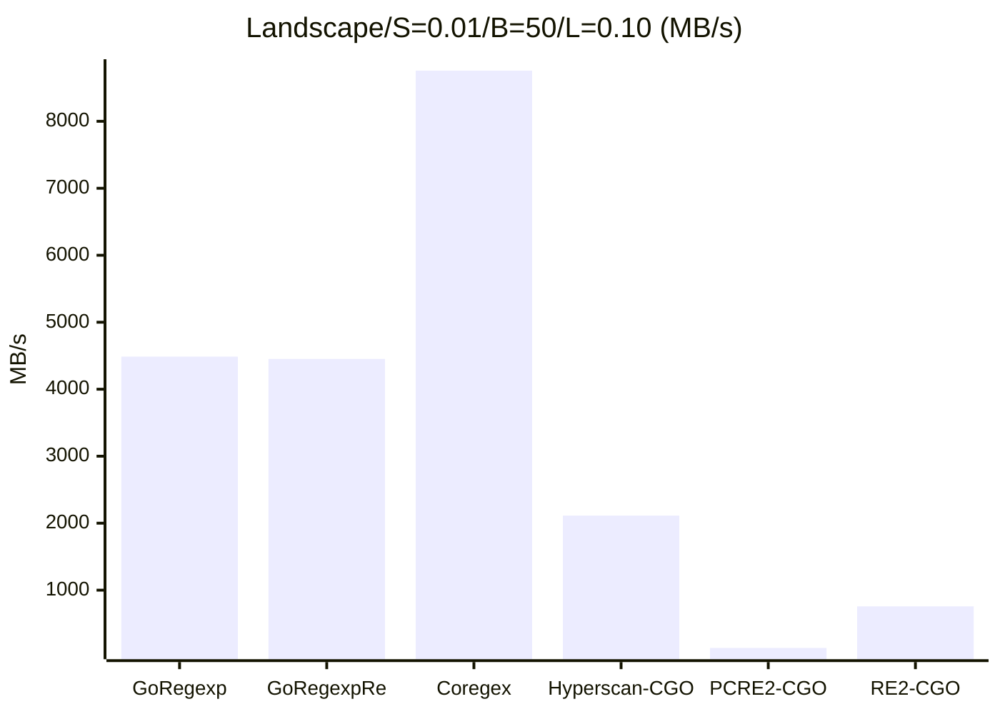
```mermaid
xychart-beta
    title "Landscape/S=0.01/B=50/L=0.10 (MB/s)"
    x-axis ["GoRegexp", "GoRegexpRe", "Coregex", "Hyperscan-CGO", "PCRE2-CGO", "RE2-CGO"]
    y-axis "MB/s"
    bar [4486.30, 4452.59, 8757.00, 2113.03, 137.19, 758.55]
```

### Landscape/S=0.01/B=50/L=0.90
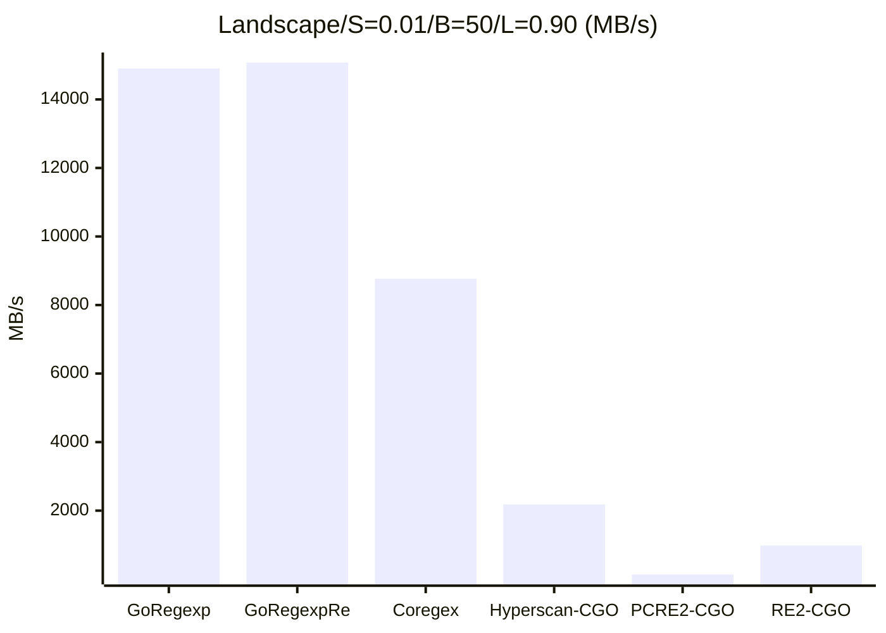
```mermaid
xychart-beta
    title "Landscape/S=0.01/B=50/L=0.90 (MB/s)"
    x-axis ["GoRegexp", "GoRegexpRe", "Coregex", "Hyperscan-CGO", "PCRE2-CGO", "RE2-CGO"]
    y-axis "MB/s"
    bar [14902.40, 15075.39, 8766.85, 2181.38, 137.71, 981.17]
```

### Landscape/S=0.10/B=1/L=0.10
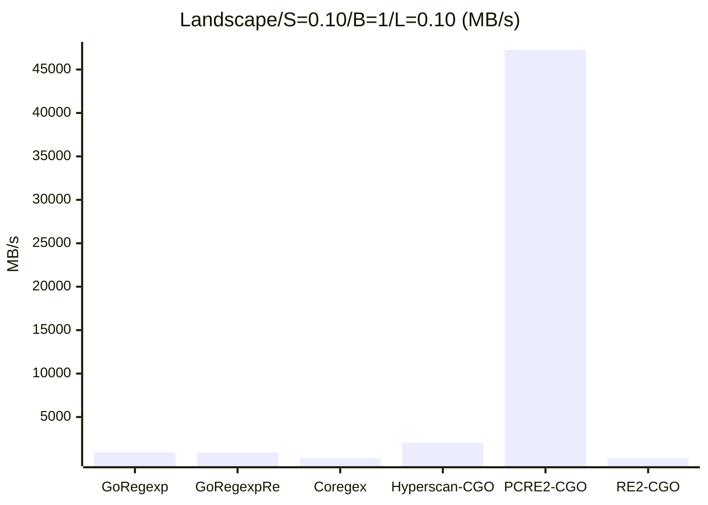
```mermaid
xychart-beta
    title "Landscape/S=0.10/B=1/L=0.10 (MB/s)"
    x-axis ["GoRegexp", "GoRegexpRe", "Coregex", "Hyperscan-CGO", "PCRE2-CGO", "RE2-CGO"]
    y-axis "MB/s"
    bar [931.39, 911.06, 247.04, 2009.74, 47257.16, 247.12]
```

### Landscape/S=0.10/B=1/L=0.90
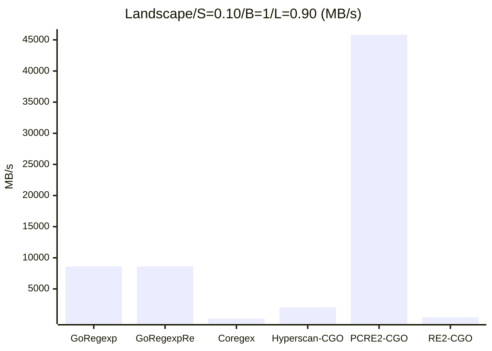
```mermaid
xychart-beta
    title "Landscape/S=0.10/B=1/L=0.90 (MB/s)"
    x-axis ["GoRegexp", "GoRegexpRe", "Coregex", "Hyperscan-CGO", "PCRE2-CGO", "RE2-CGO"]
    y-axis "MB/s"
    bar [8613.61, 8611.26, 247.14, 2044.60, 45830.20, 465.55]
```

### Landscape/S=0.10/B=10/L=0.10
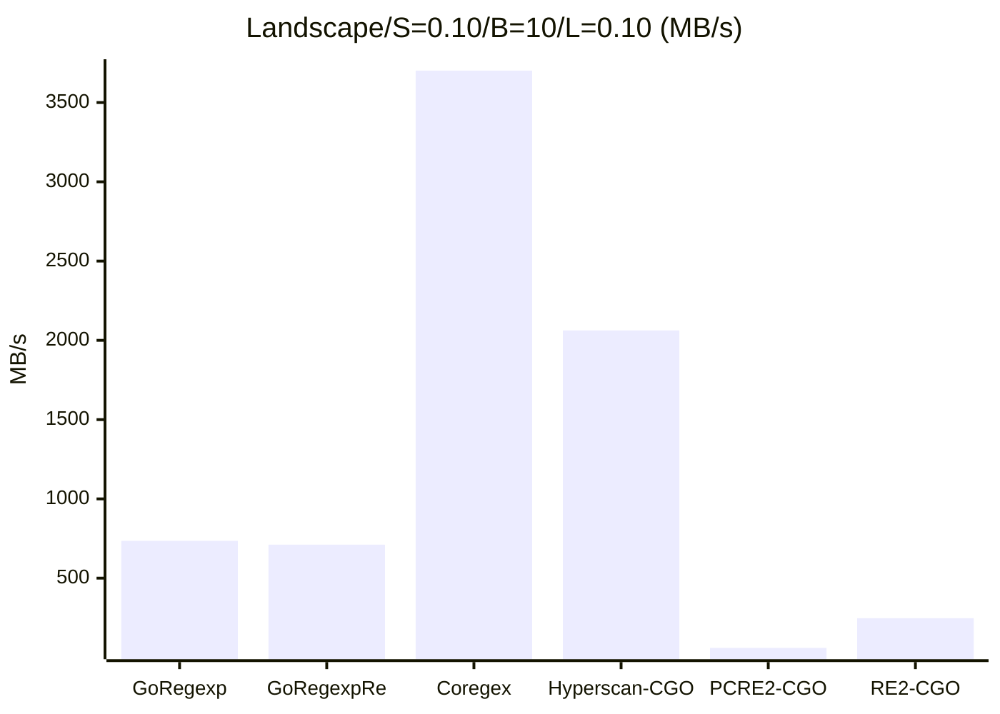
```mermaid
xychart-beta
    title "Landscape/S=0.10/B=10/L=0.10 (MB/s)"
    x-axis ["GoRegexp", "GoRegexpRe", "Coregex", "Hyperscan-CGO", "PCRE2-CGO", "RE2-CGO"]
    y-axis "MB/s"
    bar [735.25, 711.11, 3701.58, 2062.59, 59.64, 247.60]
```

### Landscape/S=0.10/B=10/L=0.90
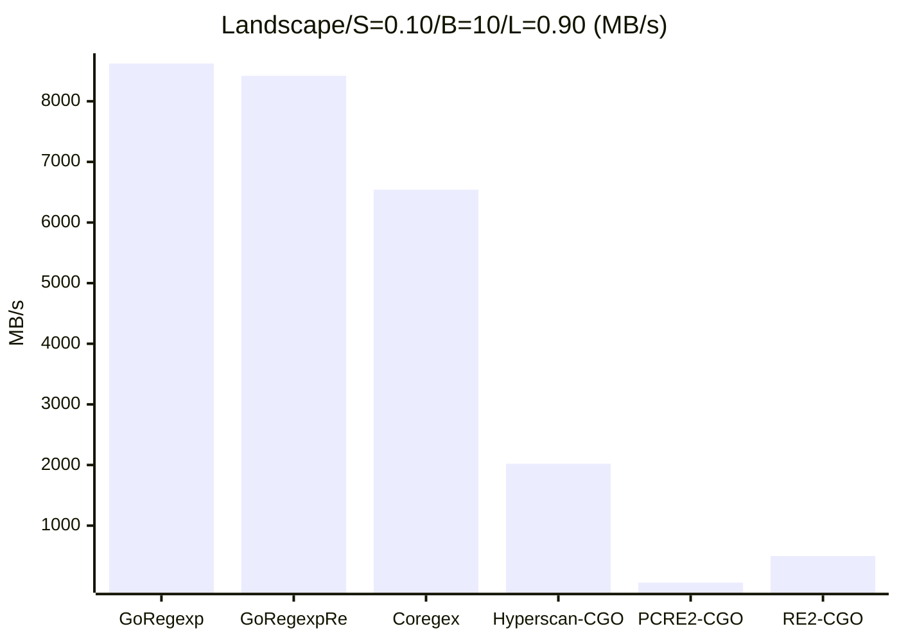
```mermaid
xychart-beta
    title "Landscape/S=0.10/B=10/L=0.90 (MB/s)"
    x-axis ["GoRegexp", "GoRegexpRe", "Coregex", "Hyperscan-CGO", "PCRE2-CGO", "RE2-CGO"]
    y-axis "MB/s"
    bar [8623.77, 8420.15, 6541.68, 2020.39, 59.60, 498.85]
```

### Landscape/S=0.10/B=50/L=0.10
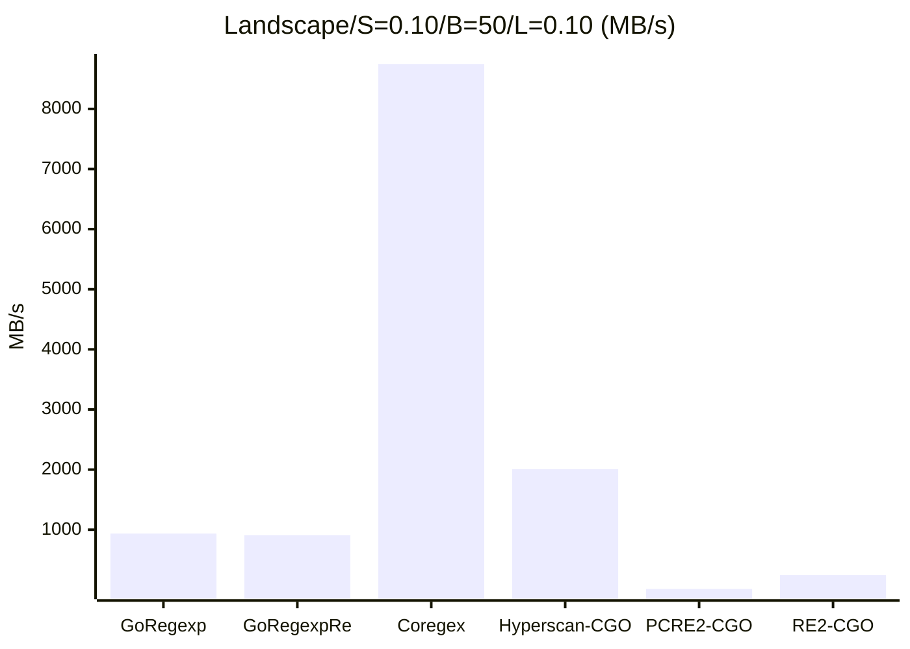
```mermaid
xychart-beta
    title "Landscape/S=0.10/B=50/L=0.10 (MB/s)"
    x-axis ["GoRegexp", "GoRegexpRe", "Coregex", "Hyperscan-CGO", "PCRE2-CGO", "RE2-CGO"]
    y-axis "MB/s"
    bar [935.99, 910.66, 8744.66, 2008.00, 14.50, 245.19]
```

### Landscape/S=0.10/B=50/L=0.90
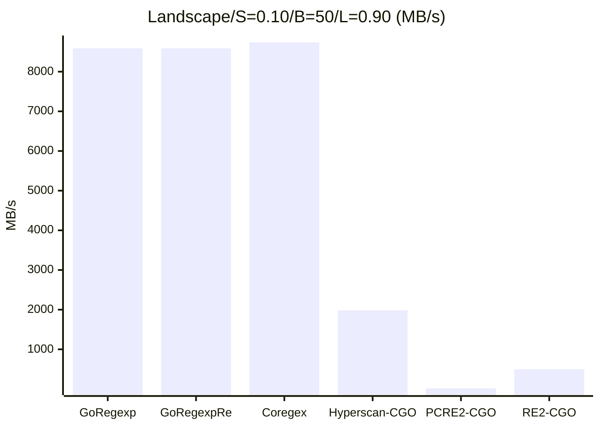
```mermaid
xychart-beta
    title "Landscape/S=0.10/B=50/L=0.90 (MB/s)"
    x-axis ["GoRegexp", "GoRegexpRe", "Coregex", "Hyperscan-CGO", "PCRE2-CGO", "RE2-CGO"]
    y-axis "MB/s"
    bar [8589.62, 8589.90, 8740.46, 1983.04, 14.69, 499.17]
```

### Landscape/S=0.50/B=1/L=0.10
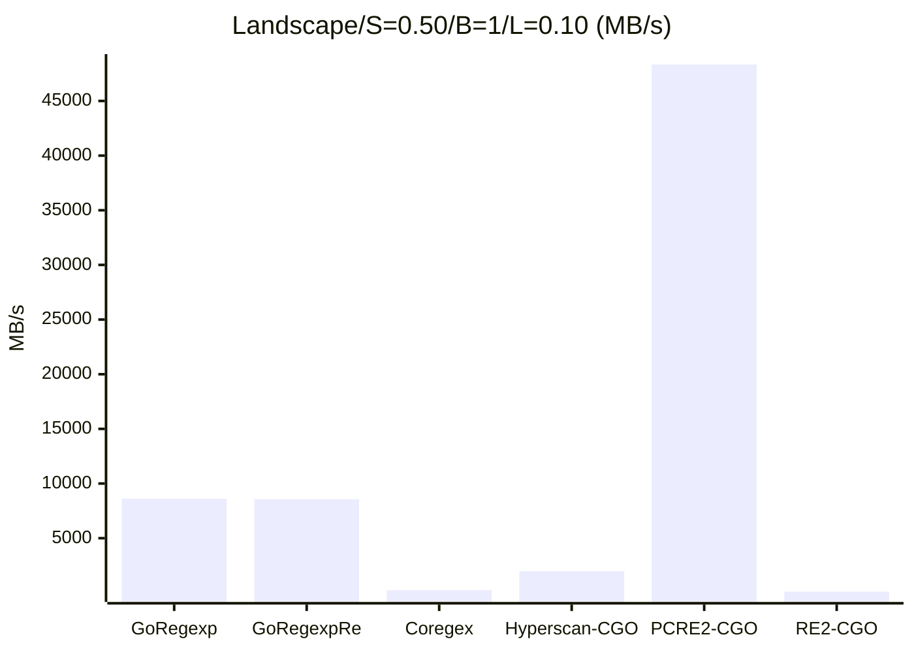
```mermaid
xychart-beta
    title "Landscape/S=0.50/B=1/L=0.10 (MB/s)"
    x-axis ["GoRegexp", "GoRegexpRe", "Coregex", "Hyperscan-CGO", "PCRE2-CGO", "RE2-CGO"]
    y-axis "MB/s"
    bar [8601.51, 8563.86, 246.88, 1981.90, 48338.68, 104.77]
```

### Landscape/S=0.50/B=1/L=0.90
```mermaid
xychart-beta
    title "Landscape/S=0.50/B=1/L=0.90 (MB/s)"
    x-axis ["GoRegexp", "GoRegexpRe", "Coregex", "Hyperscan-CGO", "PCRE2-CGO", "RE2-CGO"]
    y-axis "MB/s"
    bar [8576.81, 8606.58, 246.31, 2147.60, 46872.55, 189.58]
```

### Landscape/S=0.50/B=10/L=0.10
```mermaid
xychart-beta
    title "Landscape/S=0.50/B=10/L=0.10 (MB/s)"
    x-axis ["GoRegexp", "GoRegexpRe", "Coregex", "Hyperscan-CGO", "PCRE2-CGO", "RE2-CGO"]
    y-axis "MB/s"
    bar [8585.92, 8574.97, 6571.68, 1499.35, 14.93, 104.47]
```

### Landscape/S=0.50/B=10/L=0.90
```mermaid
xychart-beta
    title "Landscape/S=0.50/B=10/L=0.90 (MB/s)"
    x-axis ["GoRegexp", "GoRegexpRe", "Coregex", "Hyperscan-CGO", "PCRE2-CGO", "RE2-CGO"]
    y-axis "MB/s"
    bar [8568.40, 8523.79, 6579.42, 1447.33, 14.97, 191.97]
```

### Landscape/S=0.50/B=50/L=0.10
```mermaid
xychart-beta
    title "Landscape/S=0.50/B=50/L=0.10 (MB/s)"
    x-axis ["GoRegexp", "GoRegexpRe", "Coregex", "Hyperscan-CGO", "PCRE2-CGO", "RE2-CGO"]
    y-axis "MB/s"
    bar [8614.03, 8588.96, 8743.27, 1462.44, 3.61, 104.57]
```

### Landscape/S=0.50/B=50/L=0.90
```mermaid
xychart-beta
    title "Landscape/S=0.50/B=50/L=0.90 (MB/s)"
    x-axis ["GoRegexp", "GoRegexpRe", "Coregex", "Hyperscan-CGO", "PCRE2-CGO", "RE2-CGO"]
    y-axis "MB/s"
    bar [8564.87, 8602.44, 8729.50, 1405.09, 3.61, 191.85]
```

### Landscape/S=0.90/B=1/L=0.10
```mermaid
xychart-beta
    title "Landscape/S=0.90/B=1/L=0.10 (MB/s)"
    x-axis ["GoRegexp", "GoRegexpRe", "Coregex", "Hyperscan-CGO", "PCRE2-CGO", "RE2-CGO"]
    y-axis "MB/s"
    bar [8462.18, 8599.87, 247.28, 1901.83, 49948.66, 91.52]
```

### Landscape/S=0.90/B=1/L=0.90
```mermaid
xychart-beta
    title "Landscape/S=0.90/B=1/L=0.90 (MB/s)"
    x-axis ["GoRegexp", "GoRegexpRe", "Coregex", "Hyperscan-CGO", "PCRE2-CGO", "RE2-CGO"]
    y-axis "MB/s"
    bar [8569.10, 8619.90, 247.74, 1933.33, 48266.97, 143.20]
```

### Landscape/S=0.90/B=10/L=0.10
```mermaid
xychart-beta
    title "Landscape/S=0.90/B=10/L=0.10 (MB/s)"
    x-axis ["GoRegexp", "GoRegexpRe", "Coregex", "Hyperscan-CGO", "PCRE2-CGO", "RE2-CGO"]
    y-axis "MB/s"
    bar [8566.86, 8580.53, 6589.57, 1373.28, 9.99, 91.96]
```

### Landscape/S=0.90/B=10/L=0.90
```mermaid
xychart-beta
    title "Landscape/S=0.90/B=10/L=0.90 (MB/s)"
    x-axis ["GoRegexp", "GoRegexpRe", "Coregex", "Hyperscan-CGO", "PCRE2-CGO", "RE2-CGO"]
    y-axis "MB/s"
    bar [8492.99, 8610.90, 6584.89, 1314.52, 9.84, 143.54]
```

### Landscape/S=0.90/B=50/L=0.10
```mermaid
xychart-beta
    title "Landscape/S=0.90/B=50/L=0.10 (MB/s)"
    x-axis ["GoRegexp", "GoRegexpRe", "Coregex", "Hyperscan-CGO", "PCRE2-CGO", "RE2-CGO"]
    y-axis "MB/s"
    bar [8552.55, 8624.73, 8650.25, 1364.95, 1.29, 63.86]
```

### Landscape/S=0.90/B=50/L=0.90
```mermaid
xychart-beta
    title "Landscape/S=0.90/B=50/L=0.90 (MB/s)"
    x-axis ["GoRegexp", "GoRegexpRe", "Coregex", "Hyperscan-CGO", "PCRE2-CGO", "RE2-CGO"]
    y-axis "MB/s"
    bar [8536.56, 8602.90, 6524.65, 1339.09, 2.37, 143.58]
```

### LargeAlternation/Count=10
```mermaid
xychart-beta
    title "LargeAlternation/Count=10 (MB/s)"
    x-axis ["GoRegexp", "GoRegexpRe", "Coregex", "Hyperscan-CGO", "PCRE2-CGO", "RE2-CGO"]
    y-axis "MB/s"
    bar [29372.17, 33780.08, 6598.49, 1550.34, 46686.56, 1111.46]
```

### LargeAlternation/Count=100
```mermaid
xychart-beta
    title "LargeAlternation/Count=100 (MB/s)"
    x-axis ["GoRegexp", "GoRegexpRe", "Coregex", "Hyperscan-CGO", "PCRE2-CGO", "RE2-CGO"]
    y-axis "MB/s"
    bar [32651.25, 32962.52, 6466.41, 1662.54, 44392.41, 1114.07]
```

### LargeAlternation/Count=1000
```mermaid
xychart-beta
    title "LargeAlternation/Count=1000 (MB/s)"
    x-axis ["GoRegexp", "GoRegexpRe", "Coregex", "Hyperscan-CGO", "PCRE2-CGO", "RE2-CGO"]
    y-axis "MB/s"
    bar [25745.54, 34592.74, 6257.12, 1682.71, 27003.41, 1109.86]
```

### LargeAlternation/Count=10000
```mermaid
xychart-beta
    title "LargeAlternation/Count=10000 (MB/s)"
    x-axis ["GoRegexp", "GoRegexpRe", "Coregex", "RE2-CGO"]
    y-axis "MB/s"
    bar [19995.14, 34821.23, 54.94, 1089.02]
```

### LiteralScan/pat=Sherlock
```mermaid
xychart-beta
    title "LiteralScan/pat=Sherlock (MB/s)"
    x-axis ["GoRegexp", "GoRegexpRe", "Coregex", "Hyperscan-CGO", "PCRE2-CGO", "RE2-CGO"]
    y-axis "MB/s"
    bar [3291325.88, 39613896.48, 6309110.30, 2032.03, 775823.10, 5435.00]
```

### LiteralScan/pat=The_Adventure_of_the_Speckled_Band
```mermaid
xychart-beta
    title "LiteralScan/pat=The_Adventure_of_the_Speckled_Band (MB/s)"
    x-axis ["GoRegexp", "GoRegexpRe", "Coregex", "Hyperscan-CGO", "PCRE2-CGO", "RE2-CGO"]
    y-axis "MB/s"
    bar [880237.35, 4239833.19, 2687226.52, 2292.93, 417406.72, 5097.06]
```

### NFAWorstCase/Run
```mermaid
xychart-beta
    title "NFAWorstCase/Run (MB/s)"
    x-axis ["GoRegexp", "GoRegexpRe", "Coregex", "Hyperscan-CGO", "PCRE2-CGO", "RE2-CGO"]
    y-axis "MB/s"
    bar [19.65, 15.37, 246.47, 1935.83, 43258.16, 136.22]
```

### StandardSuite/Alternation/(fo|foo)
```mermaid
xychart-beta
    title "StandardSuite/Alternation/(fo|foo) (MB/s)"
    x-axis ["GoRegexp", "GoRegexpRe", "Coregex", "Hyperscan-CGO", "PCRE2-CGO", "RE2-CGO"]
    y-axis "MB/s"
    bar [4900671.30, 25448439.11, 12272969.83, 1825.53, 534892.93, 5621.14]
```

### StandardSuite/Anchored/^(?:a)$
```mermaid
xychart-beta
    title "StandardSuite/Anchored/^(?:a)$ (MB/s)"
    x-axis ["GoRegexp", "GoRegexpRe", "Coregex", "Hyperscan-CGO", "PCRE2-CGO", "RE2-CGO"]
    y-axis "MB/s"
    bar [25683016.90, 60110275.92, 182966975.35, 2089.30, 340567.42, 5640.86]
```

### StandardSuite/CharClass/(?i)[@-A]+
```mermaid
xychart-beta
    title "StandardSuite/CharClass/(?i)[@-A]+ (MB/s)"
    x-axis ["GoRegexp", "GoRegexpRe", "Coregex", "Hyperscan-CGO", "PCRE2-CGO", "RE2-CGO"]
    y-axis "MB/s"
    bar [6257752.81, 20285852.11, 87035331.22, 1991.05, 340962.75, 5606.38]
```

### StandardSuite/Complex/a+
```mermaid
xychart-beta
    title "StandardSuite/Complex/a+ (MB/s)"
    x-axis ["GoRegexp", "GoRegexpRe", "Coregex", "Hyperscan-CGO", "PCRE2-CGO", "RE2-CGO"]
    y-axis "MB/s"
    bar [6774015.82, 19497732.12, 12537952.50, 2224.52, 535130.87, 5595.08]
```

### StandardSuite/Literal/a
```mermaid
xychart-beta
    title "StandardSuite/Literal/a (MB/s)"
    x-axis ["GoRegexp", "GoRegexpRe", "Coregex", "Hyperscan-CGO", "PCRE2-CGO", "RE2-CGO"]
    y-axis "MB/s"
    bar [7713265.19, 47370965.09, 12425537.30, 1908.84, 602069.09, 5544.44]
```

### Synthetic/CCWarp
```mermaid
xychart-beta
    title "Synthetic/CCWarp (MB/s)"
    x-axis ["GoRegexp", "GoRegexpRe", "Coregex", "Hyperscan-CGO", "PCRE2-CGO", "RE2-CGO"]
    y-axis "MB/s"
    bar [67.07, 4802.96, 14.85, 865.74, 970.22, 142.30]
```

### Synthetic/PureDFA
```mermaid
xychart-beta
    title "Synthetic/PureDFA (MB/s)"
    x-axis ["GoRegexp", "GoRegexpRe", "Coregex", "Hyperscan-CGO", "PCRE2-CGO", "RE2-CGO"]
    y-axis "MB/s"
    bar [34.63, 263.24, 5.92, 877.27, 5.14, 141.86]
```

### Synthetic/SIMDWarp
```mermaid
xychart-beta
    title "Synthetic/SIMDWarp (MB/s)"
    x-axis ["GoRegexp", "GoRegexpRe", "Coregex", "Hyperscan-CGO", "PCRE2-CGO", "RE2-CGO"]
    y-axis "MB/s"
    bar [30669.61, 30225.26, 36710.60, 1924.53, 51448.23, 1081.36]
```

### Synthetic/SearchWarp
```mermaid
xychart-beta
    title "Synthetic/SearchWarp (MB/s)"
    x-axis ["GoRegexp", "GoRegexpRe", "Coregex", "Hyperscan-CGO", "PCRE2-CGO", "RE2-CGO"]
    y-axis "MB/s"
    bar [42.22, 3783.84, 815.31, 2484.20, 1230.92, 140.09]
```
