## Benchmark Comparison (Average ns/op)
| Test Case | GoRegexp | GoRegexpRe | Coregex | Hyperscan-CGO | PCRE2-CGO | RE2-CGO | RE2-Wasm |
|---|---|---|---|---|---|---|---|
| Anchors/pat=(?m)HTTP/1.1$ | 4071767.40 | 1606551.60 | 1431169.20 | 2444667.20 | 1060317.00 | 3555738.60 | 3543040.00 |
| Anchors/pat=(?m)^127.0.0.1 | 78018809.00 | 285822.80 | 370146.60 | 1452568.20 | 4956044.00 | 17498087.80 | 17710333.80 |
| Anchors/pat=HTTP/1.1$ | 6172867.40 | 51.81 | 39.71 | 1201796.00 | 1062758.00 | 469512.80 | 458667.80 |
| Anchors/pat=\bGET\b | 1518.80 | 71.36 | 200.64 | 1299191.00 | 1917.20 | 477819.60 | 454474.20 |
| Anchors/pat=^127.0.0.1 | 65.36 | 27.92 | 5.85 | 1100717.40 | 1735.20 | 452680.80 | 458667.80 |
| Capturing/Email | 2616.80 | 1133.80 | 5169.20 | 424473.80 | 2698.60 | 200054.20 | 199803.20 |
| Capturing/URI | 573.40 | 96.55 | 4121851.00 | 388299.40 | 1869.00 | 198320.60 | 197325.40 |
| Landscape/S=0.01/B=1/L=0.10 | 233511.00 | 237644.40 | 4260337.40 | 549876.20 | 23288.40 | 1331743.20 | 1384689.20 |
| Landscape/S=0.01/B=1/L=0.90 | 70734.40 | 70480.00 | 5920778.20 | 550536.80 | 23023.20 | 1072659.20 | 1088728.60 |
| Landscape/S=0.01/B=10/L=0.10 | 233786.20 | 235109.40 | 282101.20 | 490062.40 | 1995615.40 | 1321916.60 | 1328454.60 |
| Landscape/S=0.01/B=10/L=0.90 | 71326.40 | 69611.20 | 283614.00 | 468705.00 | 1894729.20 | 1110976.40 | 1068321.00 |
| Landscape/S=0.01/B=50/L=0.10 | 235216.00 | 235622.00 | 142146.80 | 503701.60 | 7735389.60 | 1335173.60 | 1345885.60 |
| Landscape/S=0.01/B=50/L=0.90 | 70912.20 | 70917.40 | 120686.00 | 509140.20 | 7568123.00 | 1089435.40 | 1064278.60 |
| Landscape/S=0.10/B=1/L=0.10 | 1120730.80 | 1150523.80 | 4242680.60 | 562651.40 | 22339.20 | 4255055.80 | 4234998.00 |
| Landscape/S=0.10/B=1/L=0.90 | 122583.00 | 121777.20 | 4255466.00 | 533469.40 | 22171.80 | 2109608.60 | 2115676.20 |
| Landscape/S=0.10/B=10/L=0.10 | 1121671.40 | 1161932.60 | 159627.40 | 576985.00 | 17818358.60 | 4291185.60 | 4278728.40 |
| Landscape/S=0.10/B=10/L=0.90 | 121984.40 | 121774.00 | 162028.60 | 539647.60 | 17923328.20 | 2107501.40 | 2121860.40 |
| Landscape/S=0.10/B=50/L=0.10 | 1120824.80 | 1152713.00 | 121770.20 | 531005.80 | 71251849.60 | 4231565.00 | 4249142.40 |
| Landscape/S=0.10/B=50/L=0.90 | 122041.20 | 121736.60 | 119642.00 | 539677.00 | 71441285.80 | 2104730.20 | 2124103.40 |
| Landscape/S=0.50/B=1/L=0.10 | 122991.00 | 121403.40 | 4256102.00 | 515942.60 | 22499.40 | 10039554.20 | 10063799.00 |
| Landscape/S=0.50/B=1/L=0.90 | 122476.00 | 122197.80 | 4257965.60 | 499267.20 | 22557.00 | 5461211.60 | 5462028.40 |
| Landscape/S=0.50/B=10/L=0.10 | 123633.40 | 121824.20 | 159447.00 | 726187.60 | 70643242.80 | 10057366.80 | 10023984.40 |
| Landscape/S=0.50/B=10/L=0.90 | 123097.80 | 123502.60 | 158505.40 | 743906.00 | 70934546.60 | 5481535.20 | 5513343.20 |
| Landscape/S=0.50/B=50/L=0.10 | 122373.60 | 122493.40 | 120007.20 | 802613.40 | 292670572.60 | 10138472.00 | 10121565.00 |
| Landscape/S=0.50/B=50/L=0.90 | 122242.80 | 122274.80 | 119847.40 | 1061626.80 | 291104867.80 | 5498624.60 | 5492944.80 |
| Landscape/S=0.90/B=1/L=0.10 | 122348.60 | 121733.20 | 4300086.40 | 1257029.80 | 22637.40 | 11405527.40 | 11420287.40 |
| Landscape/S=0.90/B=1/L=0.90 | 122449.00 | 123388.20 | 4251469.40 | 1184984.00 | 21543.00 | 7306208.40 | 7288819.80 |
| Landscape/S=0.90/B=10/L=0.10 | 122472.00 | 121959.20 | 161254.60 | 1381982.00 | 105221819.40 | 11446686.20 | 11432720.40 |
| Landscape/S=0.90/B=10/L=0.90 | 123927.60 | 121892.20 | 159350.00 | 794385.60 | 105902865.40 | 7293939.60 | 7279182.80 |
| Landscape/S=0.90/B=50/L=0.10 | 122431.80 | 122135.20 | 120064.40 | 777356.80 | 437729584.60 | 11510716.20 | 11395300.00 |
| Landscape/S=0.90/B=50/L=0.90 | 122771.80 | 121734.40 | 119884.60 | 800410.40 | 449297271.60 | 7326514.80 | 8905210.40 |
| LargeAlternation/Count=10 | 35565.20 | 29501.80 | 160198.80 | 609027.20 | 21362.00 | 962227.60 | 950536.80 |
| LargeAlternation/Count=100 | 32744.00 | 29014.00 | 162287.00 | 548803.20 | 22668.00 | 970011.80 | 948072.80 |
| LargeAlternation/Count=1000 | 37462.00 | 28998.00 | 167953.60 | 588129.40 | 38933.20 | 965697.80 | 962273.40 |
| LargeAlternation/Count=10000 | 49234.60 | 29897.80 | 19496500.80 | N/A | N/A | 955405.20 | 948822.40 |
| LiteralScan/pat=Sherlock | 368.52 | 30.85 | 192.08 | 628408.60 | 1546.60 | 223108.00 | 219987.80 |
| LiteralScan/pat=The_Adventure_of_the_Speckled_Band | 1388.00 | 284.06 | 462.98 | 620672.00 | 2842.80 | 234837.60 | 236278.40 |
| NFAWorstCase/Run | 53350306.60 | 60873322.40 | 4260477.40 | 531283.00 | 22576.40 | 7647186.80 | 7626659.20 |
| StandardSuite/Alternation/(fo\|foo) | 220.66 | 38.61 | 85.07 | 616366.60 | 1733.00 | 188824.60 | 190393.20 |
| StandardSuite/Anchored/^(?:a)$ | 40.45 | 17.39 | 5.77 | 494988.20 | 1617.60 | 187508.20 | 192193.60 |
| StandardSuite/CharClass/(?i)[@-A]+ | 167.22 | 47.44 | 11.95 | 626489.20 | 1724.80 | 188519.60 | 191007.20 |
| StandardSuite/Complex/a+ | 154.48 | 49.07 | 83.25 | 500502.40 | 1761.20 | 193174.40 | 190699.20 |
| StandardSuite/Literal/a | 142.04 | 22.21 | 83.95 | 598251.60 | 1740.20 | 188437.40 | 189340.40 |
| Synthetic/CCWarp | 15803067.60 | 31.85 | 56142173.60 | 1169152.20 | 1080371.40 | 7539185.60 | 7399565.60 |
| Synthetic/PureDFA | 29887882.60 | 4318848.20 | 345290309.20 | 1179212.60 | 202253139.40 | 7411368.00 | 7483039.80 |
| Synthetic/SIMDWarp | 35725.80 | 35548.40 | 29840.80 | 521992.40 | 21347.40 | 993887.20 | 987326.00 |
| Synthetic/SearchWarp | 24357642.60 | 279197.80 | 973789.80 | 421220.60 | 850770.00 | 7503401.60 | 7547455.20 |

## Throughput Comparison (Average MB/s)
| Test Case | GoRegexp | GoRegexpRe | Coregex | Hyperscan-CGO | PCRE2-CGO | RE2-CGO | RE2-Wasm |
|---|---|---|---|---|---|---|---|
| Anchors/pat=(?m)HTTP/1.1$ | 630.16 | 1475.70 | 1656.56 | 969.98 | 2236.01 | 666.83 | 669.14 |
| Anchors/pat=(?m)^127.0.0.1 | 30.66 | 8294.73 | 6405.10 | 1632.27 | 478.37 | 135.49 | 133.97 |
| Anchors/pat=HTTP/1.1$ | 385.56 | 45757218.81 | 59744739.43 | 1974.80 | 2232.13 | 5079.93 | 5169.22 |
| Anchors/pat=\bGET\b | 1561283.84 | 33247445.06 | 11816995.77 | 1827.98 | 1237128.66 | 5021.87 | 5220.08 |
| Anchors/pat=^127.0.0.1 | 39486396.09 | 84907190.33 | 405047219.90 | 2155.04 | 1367386.89 | 5240.02 | 5172.25 |
| Capturing/Email | 400898.97 | 924678.51 | 202868.80 | 2475.48 | 388641.18 | 5243.60 | 5249.31 |
| Capturing/URI | 1828800.37 | 10865233.88 | 254.41 | 2708.65 | 561501.96 | 5288.04 | 5315.35 |
| Landscape/S=0.01/B=1/L=0.10 | 4490.53 | 4413.11 | 246.13 | 1907.74 | 45176.29 | 787.43 | 758.19 |
| Landscape/S=0.01/B=1/L=0.90 | 14824.26 | 14879.30 | 181.68 | 1916.40 | 45824.62 | 977.73 | 963.50 |
| Landscape/S=0.01/B=10/L=0.10 | 4485.25 | 4459.99 | 3758.81 | 2150.21 | 525.46 | 793.27 | 789.36 |
| Landscape/S=0.01/B=10/L=0.90 | 14707.50 | 15063.93 | 3709.65 | 2238.87 | 553.43 | 944.69 | 981.55 |
| Landscape/S=0.01/B=50/L=0.10 | 4458.40 | 4450.26 | 7643.06 | 2091.98 | 135.56 | 785.52 | 779.61 |
| Landscape/S=0.01/B=50/L=0.90 | 14787.36 | 14793.43 | 8688.95 | 2072.71 | 138.57 | 962.77 | 985.25 |
| Landscape/S=0.10/B=1/L=0.10 | 935.62 | 911.40 | 247.15 | 1866.47 | 47021.11 | 246.44 | 247.60 |
| Landscape/S=0.10/B=1/L=0.90 | 8554.06 | 8610.69 | 246.41 | 1972.16 | 47363.26 | 497.06 | 495.63 |
| Landscape/S=0.10/B=10/L=0.10 | 934.83 | 902.55 | 6568.94 | 1819.08 | 58.85 | 244.54 | 245.19 |
| Landscape/S=0.10/B=10/L=0.90 | 8596.03 | 8610.88 | 6475.02 | 1951.70 | 58.57 | 497.55 | 494.23 |
| Landscape/S=0.10/B=50/L=0.10 | 935.54 | 909.66 | 8615.15 | 1978.88 | 14.72 | 247.81 | 246.82 |
| Landscape/S=0.10/B=50/L=0.90 | 8591.99 | 8613.50 | 8764.35 | 1951.21 | 14.68 | 498.21 | 493.80 |
| Landscape/S=0.50/B=1/L=0.10 | 8528.34 | 8637.17 | 246.37 | 2048.83 | 46642.13 | 104.44 | 104.19 |
| Landscape/S=0.50/B=1/L=0.90 | 8561.54 | 8581.18 | 246.26 | 2103.73 | 46601.40 | 192.01 | 191.98 |
| Landscape/S=0.50/B=10/L=0.10 | 8484.92 | 8607.34 | 6576.44 | 1447.64 | 14.85 | 104.26 | 104.61 |
| Landscape/S=0.50/B=10/L=0.90 | 8518.39 | 8495.62 | 6615.46 | 1411.45 | 14.79 | 191.29 | 190.25 |
| Landscape/S=0.50/B=50/L=0.10 | 8569.15 | 8560.63 | 8737.63 | 1307.81 | 3.58 | 103.46 | 103.64 |
| Landscape/S=0.50/B=50/L=0.90 | 8577.92 | 8575.69 | 8749.35 | 1096.39 | 3.60 | 190.72 | 190.91 |
| Landscape/S=0.90/B=1/L=0.10 | 8570.48 | 8613.82 | 243.95 | 836.34 | 46332.03 | 91.94 | 91.82 |
| Landscape/S=0.90/B=1/L=0.90 | 8563.45 | 8501.05 | 246.64 | 889.81 | 48686.96 | 143.52 | 143.86 |
| Landscape/S=0.90/B=10/L=0.10 | 8561.81 | 8597.84 | 6505.69 | 844.61 | 9.97 | 91.61 | 91.72 |
| Landscape/S=0.90/B=10/L=0.90 | 8465.72 | 8602.48 | 6580.56 | 1320.89 | 9.90 | 143.77 | 144.05 |
| Landscape/S=0.90/B=50/L=0.10 | 8564.63 | 8585.75 | 8733.46 | 1351.69 | 2.40 | 91.12 | 92.02 |
| Landscape/S=0.90/B=50/L=0.90 | 8540.93 | 8613.80 | 8746.60 | 1310.91 | 2.34 | 143.12 | 122.97 |
| LargeAlternation/Count=10 | 29486.00 | 35562.80 | 6545.80 | 1723.82 | 49106.93 | 1089.98 | 1103.34 |
| LargeAlternation/Count=100 | 32065.89 | 36151.99 | 6461.88 | 1917.53 | 46277.12 | 1082.16 | 1106.25 |
| LargeAlternation/Count=1000 | 27997.04 | 36163.02 | 6243.67 | 1787.86 | 26947.45 | 1086.11 | 1090.26 |
| LargeAlternation/Count=10000 | 21305.97 | 35107.04 | 53.82 | N/A | N/A | 1097.63 | 1105.28 |
| LiteralScan/pat=Sherlock | 3296819.58 | 39381818.15 | 6325520.23 | 1933.55 | 789471.02 | 5446.75 | 5523.36 |
| LiteralScan/pat=The_Adventure_of_the_Speckled_Band | 875324.56 | 4277352.06 | 2625858.61 | 1958.98 | 427624.18 | 5175.34 | 5143.41 |
| NFAWorstCase/Run | 19.66 | 17.23 | 246.14 | 1977.63 | 46493.45 | 137.13 | 137.49 |
| StandardSuite/Alternation/(fo\|foo) | 4754620.43 | 27168141.26 | 12326674.27 | 1701.25 | 607636.44 | 5555.92 | 5509.16 |
| StandardSuite/Anchored/^(?:a)$ | 25927867.60 | 60298525.16 | 181796877.52 | 2121.21 | 648473.17 | 5592.72 | 5456.23 |
| StandardSuite/CharClass/(?i)[@-A]+ | 6271057.99 | 22105125.23 | 87733390.43 | 1674.36 | 608001.31 | 5563.61 | 5492.19 |
| StandardSuite/Complex/a+ | 6788199.49 | 21369106.66 | 12594978.51 | 2095.73 | 595745.06 | 5435.15 | 5499.84 |
| StandardSuite/Literal/a | 7381975.51 | 47208299.04 | 12493446.51 | 1753.02 | 603077.79 | 5566.54 | 5539.66 |
| Synthetic/CCWarp | 66.38 | 32921504.29 | 18.68 | 896.85 | 970.59 | 139.28 | 141.71 |
| Synthetic/PureDFA | 35.09 | 242.81 | 4.95 | 889.27 | 5.18 | 141.49 | 140.20 |
| Synthetic/SIMDWarp | 30438.49 | 30597.59 | 36474.13 | 2084.49 | 50950.07 | 1094.25 | 1101.39 |
| Synthetic/SearchWarp | 43.05 | 3755.79 | 1078.04 | 2495.98 | 1232.53 | 139.75 | 138.93 |

## Performance Graphs (MB/s, higher is better)

### Anchors/pat=(?m)HTTP/1.1$
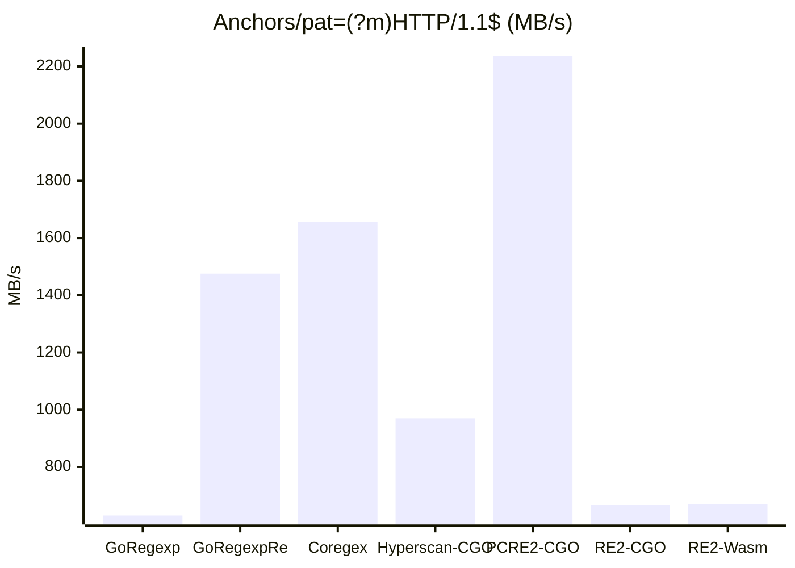
```mermaid
xychart-beta
    title "Anchors/pat=(?m)HTTP/1.1$ (MB/s)"
    x-axis ["GoRegexp", "GoRegexpRe", "Coregex", "Hyperscan-CGO", "PCRE2-CGO", "RE2-CGO", "RE2-Wasm"]
    y-axis "MB/s"
    bar [630.16, 1475.70, 1656.56, 969.98, 2236.01, 666.83, 669.14]
```

### Anchors/pat=(?m)^127.0.0.1
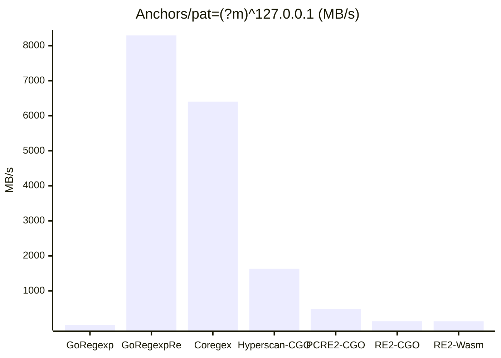
```mermaid
xychart-beta
    title "Anchors/pat=(?m)^127.0.0.1 (MB/s)"
    x-axis ["GoRegexp", "GoRegexpRe", "Coregex", "Hyperscan-CGO", "PCRE2-CGO", "RE2-CGO", "RE2-Wasm"]
    y-axis "MB/s"
    bar [30.66, 8294.73, 6405.10, 1632.27, 478.37, 135.49, 133.97]
```

### Anchors/pat=HTTP/1.1$
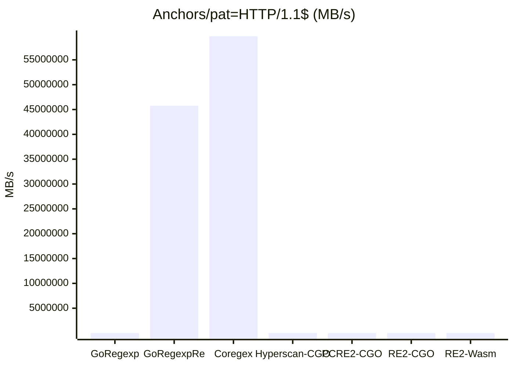
```mermaid
xychart-beta
    title "Anchors/pat=HTTP/1.1$ (MB/s)"
    x-axis ["GoRegexp", "GoRegexpRe", "Coregex", "Hyperscan-CGO", "PCRE2-CGO", "RE2-CGO", "RE2-Wasm"]
    y-axis "MB/s"
    bar [385.56, 45757218.81, 59744739.43, 1974.80, 2232.13, 5079.93, 5169.22]
```

### Anchors/pat=\bGET\b
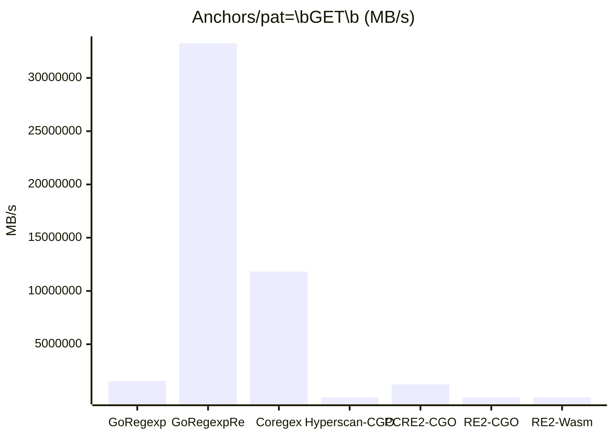
```mermaid
xychart-beta
    title "Anchors/pat=\bGET\b (MB/s)"
    x-axis ["GoRegexp", "GoRegexpRe", "Coregex", "Hyperscan-CGO", "PCRE2-CGO", "RE2-CGO", "RE2-Wasm"]
    y-axis "MB/s"
    bar [1561283.84, 33247445.06, 11816995.77, 1827.98, 1237128.66, 5021.87, 5220.08]
```

### Anchors/pat=^127.0.0.1
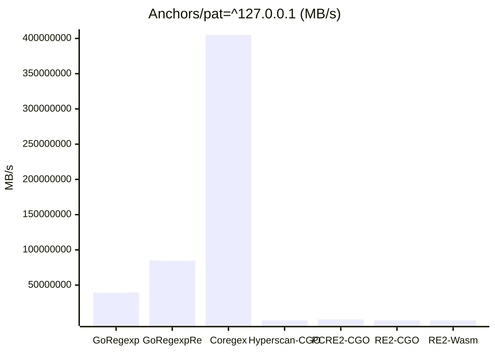
```mermaid
xychart-beta
    title "Anchors/pat=^127.0.0.1 (MB/s)"
    x-axis ["GoRegexp", "GoRegexpRe", "Coregex", "Hyperscan-CGO", "PCRE2-CGO", "RE2-CGO", "RE2-Wasm"]
    y-axis "MB/s"
    bar [39486396.09, 84907190.33, 405047219.90, 2155.04, 1367386.89, 5240.02, 5172.25]
```

### Capturing/Email
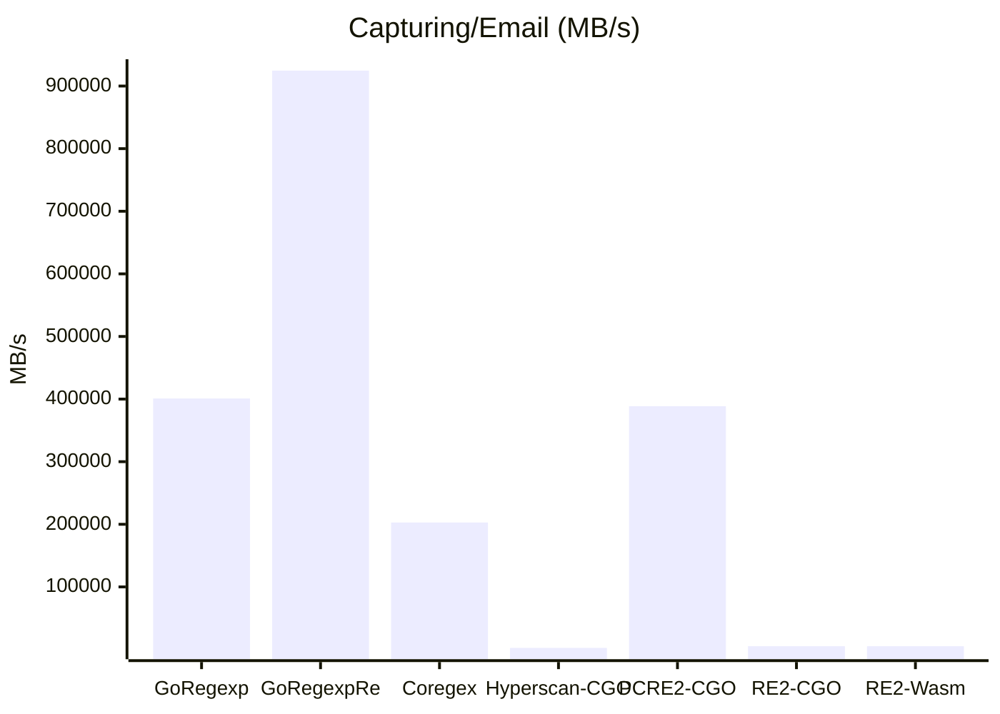
```mermaid
xychart-beta
    title "Capturing/Email (MB/s)"
    x-axis ["GoRegexp", "GoRegexpRe", "Coregex", "Hyperscan-CGO", "PCRE2-CGO", "RE2-CGO", "RE2-Wasm"]
    y-axis "MB/s"
    bar [400898.97, 924678.51, 202868.80, 2475.48, 388641.18, 5243.60, 5249.31]
```

### Capturing/URI
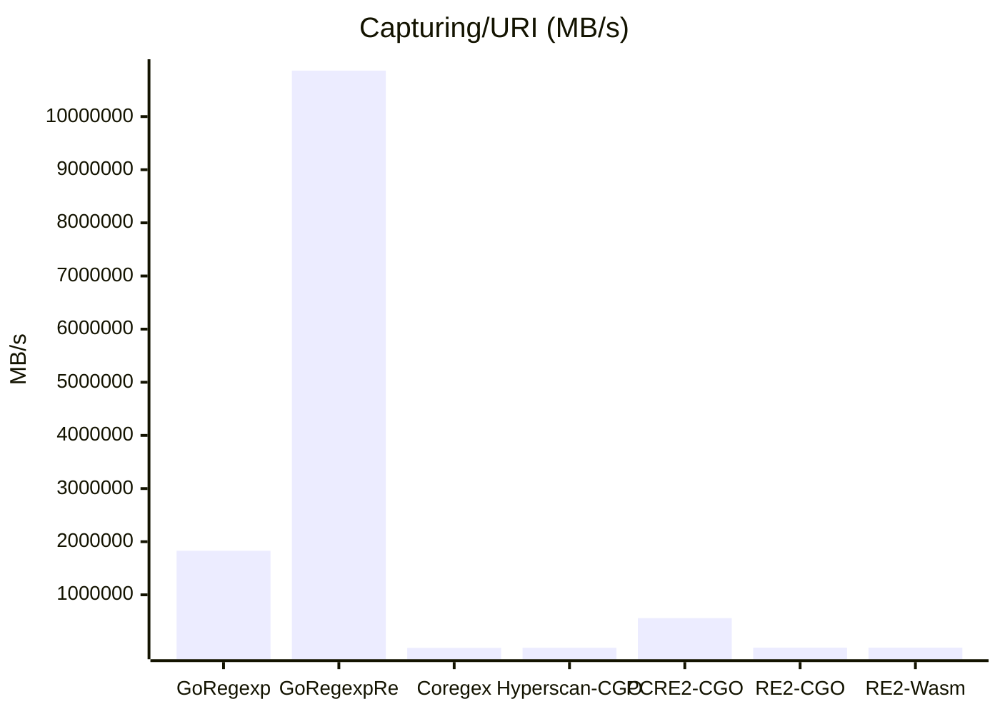
```mermaid
xychart-beta
    title "Capturing/URI (MB/s)"
    x-axis ["GoRegexp", "GoRegexpRe", "Coregex", "Hyperscan-CGO", "PCRE2-CGO", "RE2-CGO", "RE2-Wasm"]
    y-axis "MB/s"
    bar [1828800.37, 10865233.88, 254.41, 2708.65, 561501.96, 5288.04, 5315.35]
```

### Landscape/S=0.01/B=1/L=0.10
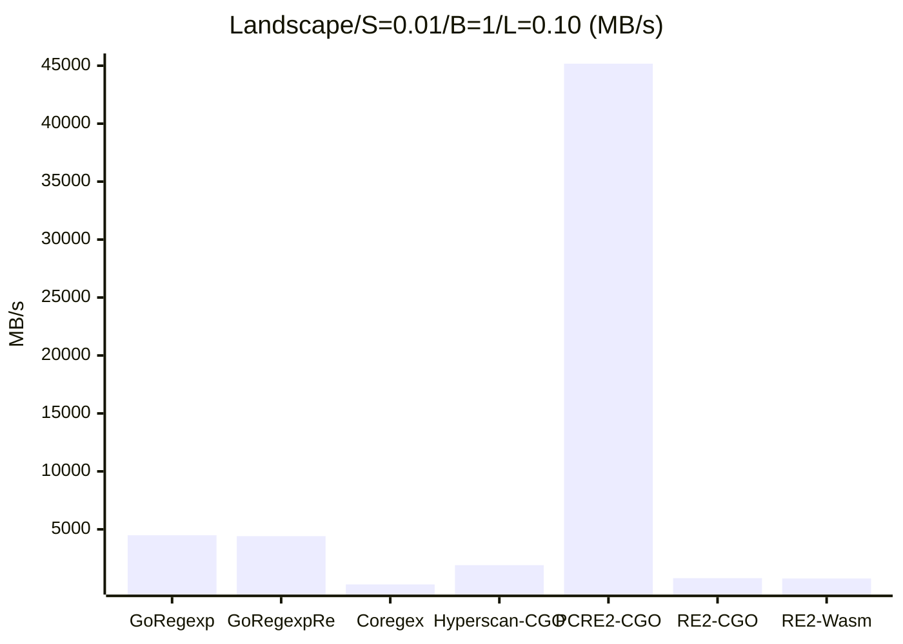
```mermaid
xychart-beta
    title "Landscape/S=0.01/B=1/L=0.10 (MB/s)"
    x-axis ["GoRegexp", "GoRegexpRe", "Coregex", "Hyperscan-CGO", "PCRE2-CGO", "RE2-CGO", "RE2-Wasm"]
    y-axis "MB/s"
    bar [4490.53, 4413.11, 246.13, 1907.74, 45176.29, 787.43, 758.19]
```

### Landscape/S=0.01/B=1/L=0.90
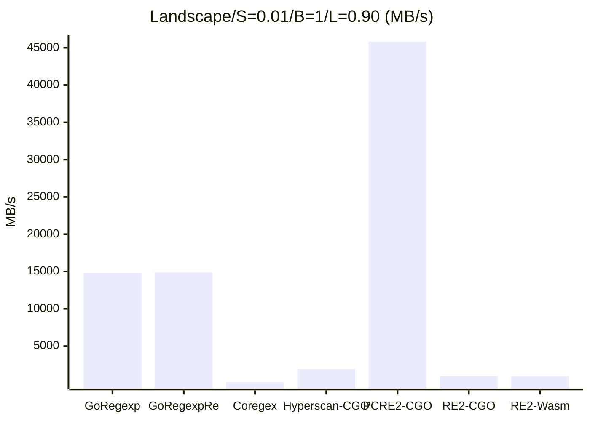
```mermaid
xychart-beta
    title "Landscape/S=0.01/B=1/L=0.90 (MB/s)"
    x-axis ["GoRegexp", "GoRegexpRe", "Coregex", "Hyperscan-CGO", "PCRE2-CGO", "RE2-CGO", "RE2-Wasm"]
    y-axis "MB/s"
    bar [14824.26, 14879.30, 181.68, 1916.40, 45824.62, 977.73, 963.50]
```

### Landscape/S=0.01/B=10/L=0.10
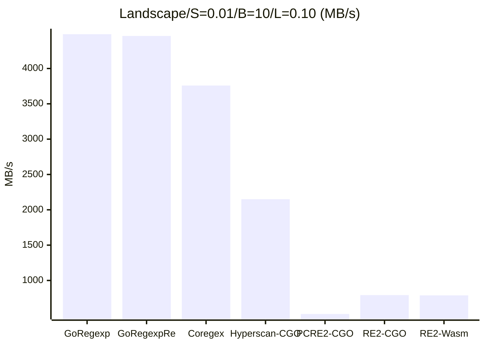
```mermaid
xychart-beta
    title "Landscape/S=0.01/B=10/L=0.10 (MB/s)"
    x-axis ["GoRegexp", "GoRegexpRe", "Coregex", "Hyperscan-CGO", "PCRE2-CGO", "RE2-CGO", "RE2-Wasm"]
    y-axis "MB/s"
    bar [4485.25, 4459.99, 3758.81, 2150.21, 525.46, 793.27, 789.36]
```

### Landscape/S=0.01/B=10/L=0.90
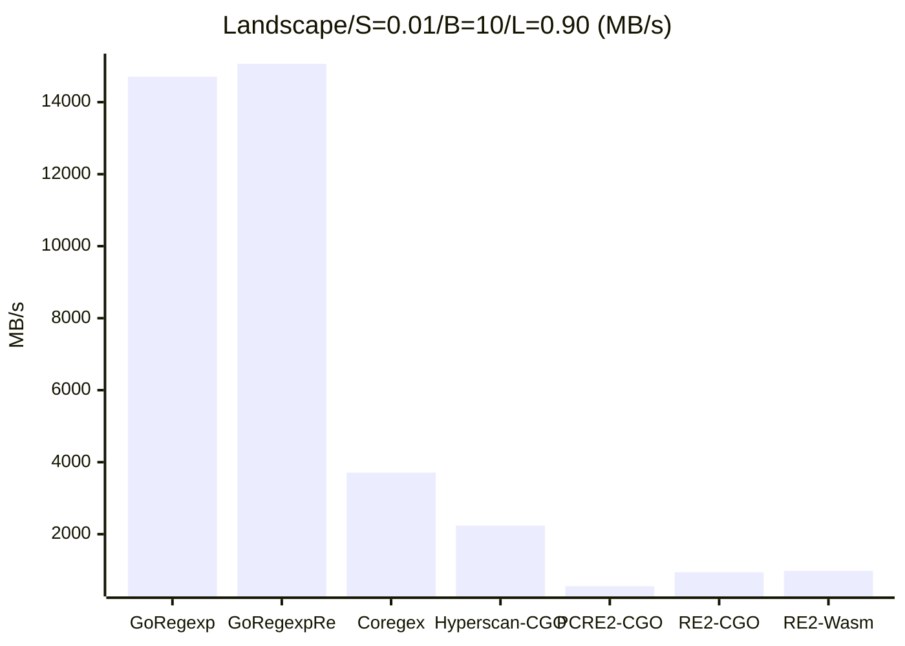
```mermaid
xychart-beta
    title "Landscape/S=0.01/B=10/L=0.90 (MB/s)"
    x-axis ["GoRegexp", "GoRegexpRe", "Coregex", "Hyperscan-CGO", "PCRE2-CGO", "RE2-CGO", "RE2-Wasm"]
    y-axis "MB/s"
    bar [14707.50, 15063.93, 3709.65, 2238.87, 553.43, 944.69, 981.55]
```

### Landscape/S=0.01/B=50/L=0.10
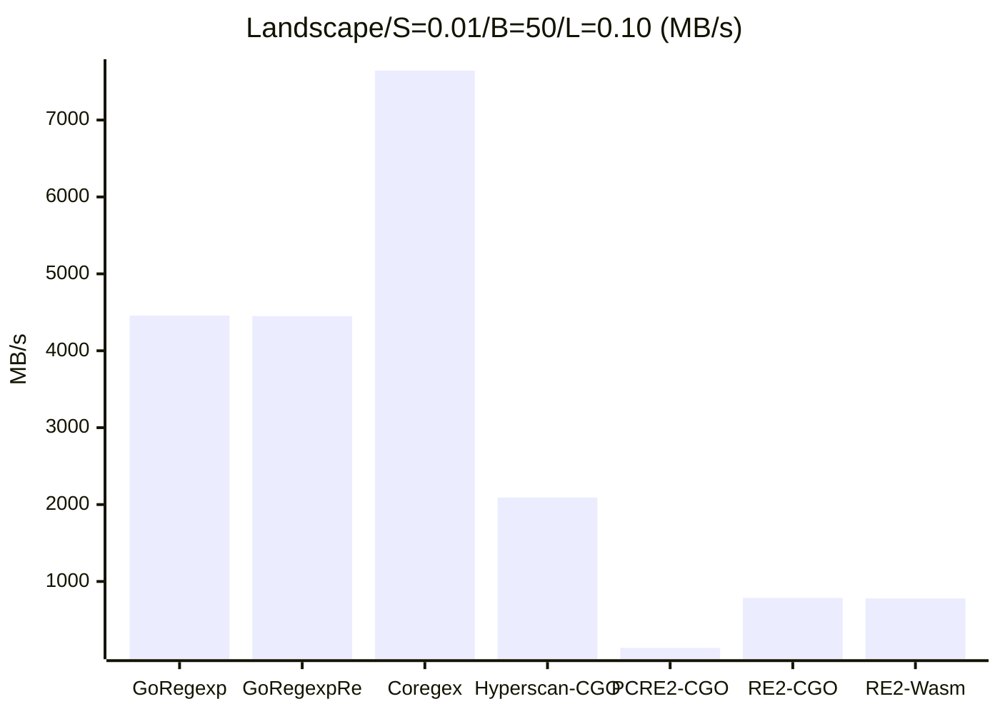
```mermaid
xychart-beta
    title "Landscape/S=0.01/B=50/L=0.10 (MB/s)"
    x-axis ["GoRegexp", "GoRegexpRe", "Coregex", "Hyperscan-CGO", "PCRE2-CGO", "RE2-CGO", "RE2-Wasm"]
    y-axis "MB/s"
    bar [4458.40, 4450.26, 7643.06, 2091.98, 135.56, 785.52, 779.61]
```

### Landscape/S=0.01/B=50/L=0.90
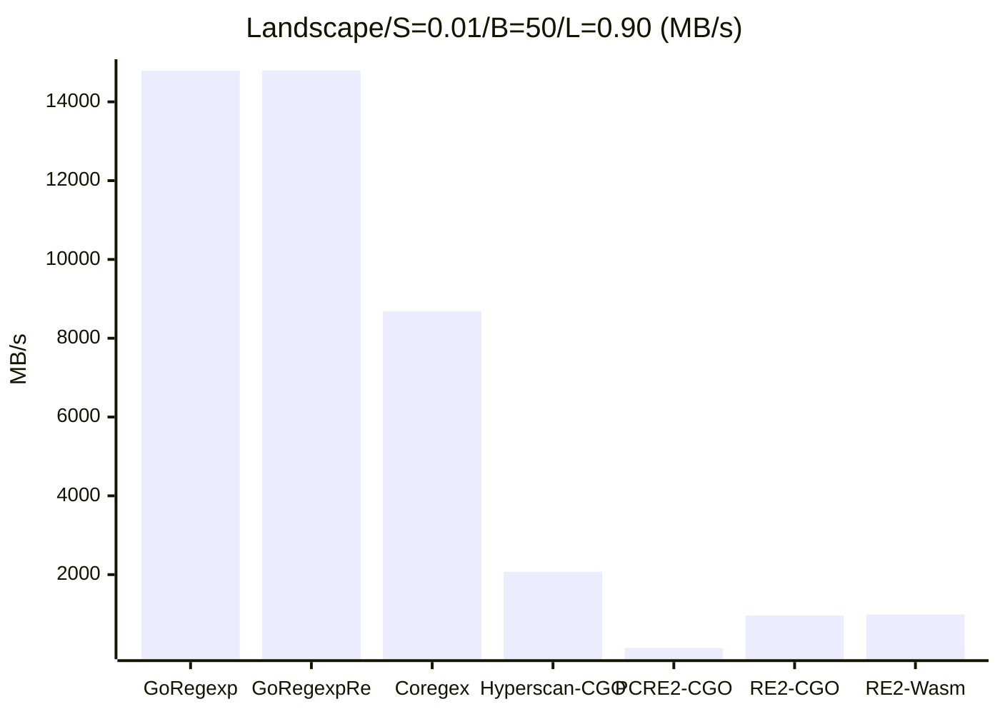
```mermaid
xychart-beta
    title "Landscape/S=0.01/B=50/L=0.90 (MB/s)"
    x-axis ["GoRegexp", "GoRegexpRe", "Coregex", "Hyperscan-CGO", "PCRE2-CGO", "RE2-CGO", "RE2-Wasm"]
    y-axis "MB/s"
    bar [14787.36, 14793.43, 8688.95, 2072.71, 138.57, 962.77, 985.25]
```

### Landscape/S=0.10/B=1/L=0.10
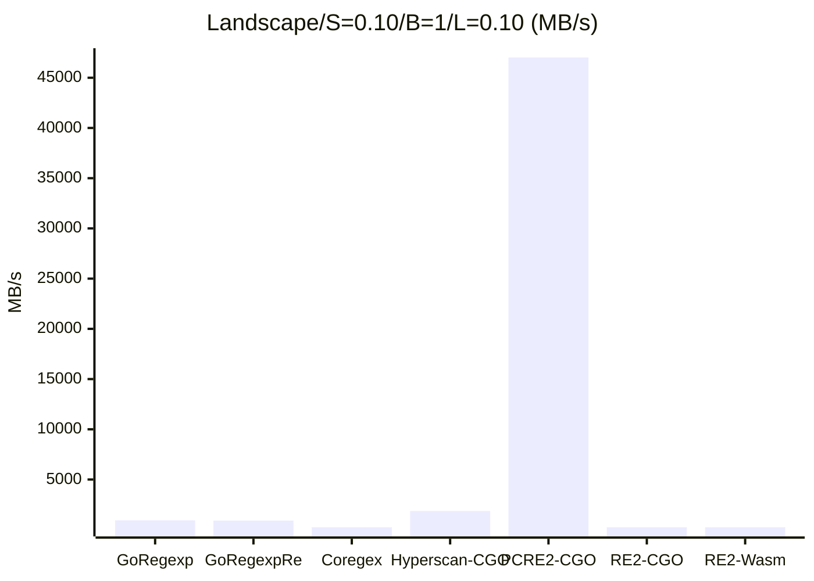
```mermaid
xychart-beta
    title "Landscape/S=0.10/B=1/L=0.10 (MB/s)"
    x-axis ["GoRegexp", "GoRegexpRe", "Coregex", "Hyperscan-CGO", "PCRE2-CGO", "RE2-CGO", "RE2-Wasm"]
    y-axis "MB/s"
    bar [935.62, 911.40, 247.15, 1866.47, 47021.11, 246.44, 247.60]
```

### Landscape/S=0.10/B=1/L=0.90
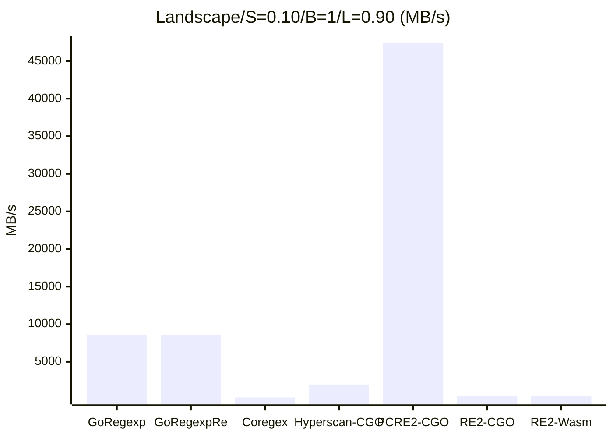
```mermaid
xychart-beta
    title "Landscape/S=0.10/B=1/L=0.90 (MB/s)"
    x-axis ["GoRegexp", "GoRegexpRe", "Coregex", "Hyperscan-CGO", "PCRE2-CGO", "RE2-CGO", "RE2-Wasm"]
    y-axis "MB/s"
    bar [8554.06, 8610.69, 246.41, 1972.16, 47363.26, 497.06, 495.63]
```

### Landscape/S=0.10/B=10/L=0.10
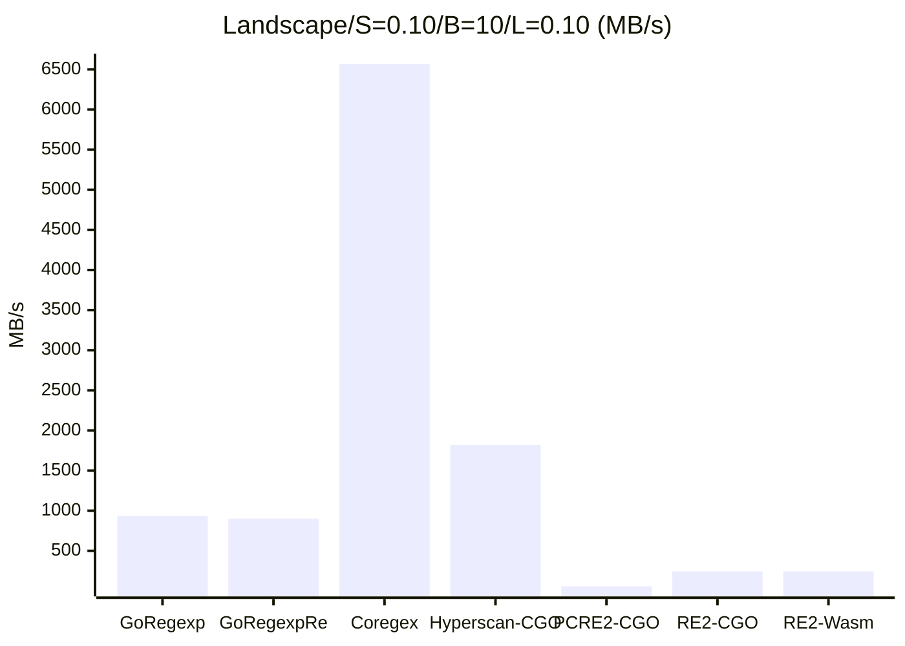
```mermaid
xychart-beta
    title "Landscape/S=0.10/B=10/L=0.10 (MB/s)"
    x-axis ["GoRegexp", "GoRegexpRe", "Coregex", "Hyperscan-CGO", "PCRE2-CGO", "RE2-CGO", "RE2-Wasm"]
    y-axis "MB/s"
    bar [934.83, 902.55, 6568.94, 1819.08, 58.85, 244.54, 245.19]
```

### Landscape/S=0.10/B=10/L=0.90
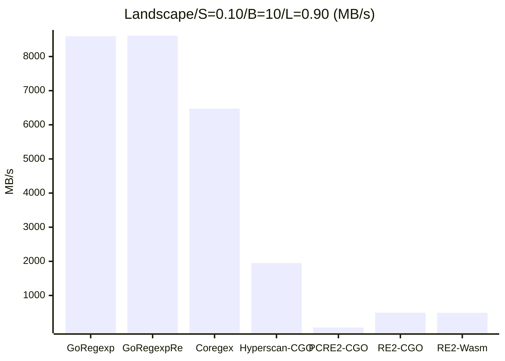
```mermaid
xychart-beta
    title "Landscape/S=0.10/B=10/L=0.90 (MB/s)"
    x-axis ["GoRegexp", "GoRegexpRe", "Coregex", "Hyperscan-CGO", "PCRE2-CGO", "RE2-CGO", "RE2-Wasm"]
    y-axis "MB/s"
    bar [8596.03, 8610.88, 6475.02, 1951.70, 58.57, 497.55, 494.23]
```

### Landscape/S=0.10/B=50/L=0.10
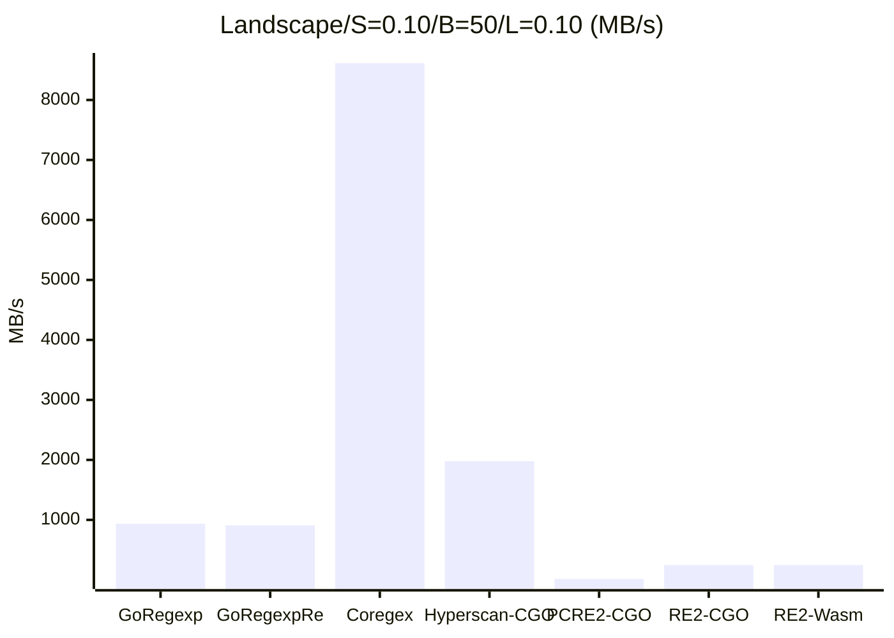
```mermaid
xychart-beta
    title "Landscape/S=0.10/B=50/L=0.10 (MB/s)"
    x-axis ["GoRegexp", "GoRegexpRe", "Coregex", "Hyperscan-CGO", "PCRE2-CGO", "RE2-CGO", "RE2-Wasm"]
    y-axis "MB/s"
    bar [935.54, 909.66, 8615.15, 1978.88, 14.72, 247.81, 246.82]
```

### Landscape/S=0.10/B=50/L=0.90
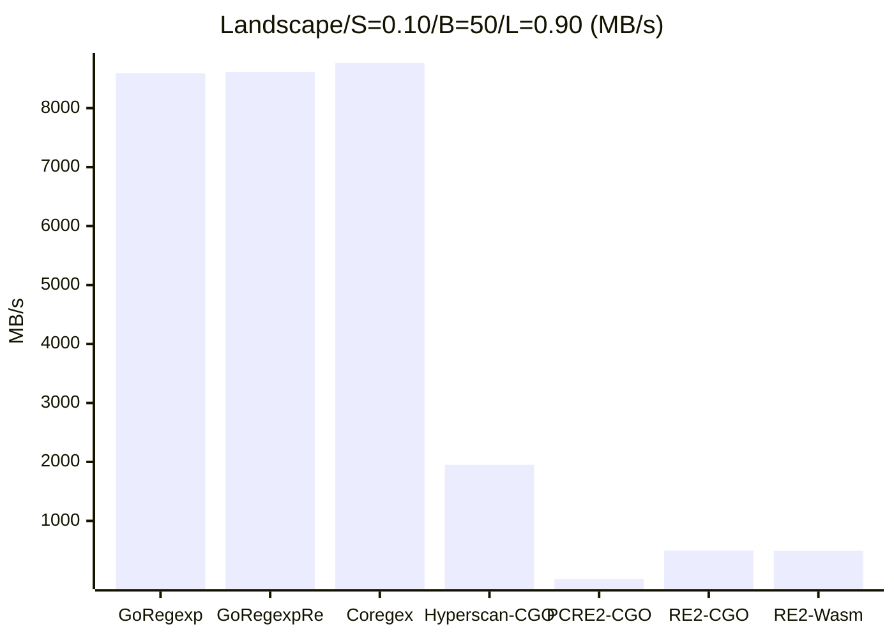
```mermaid
xychart-beta
    title "Landscape/S=0.10/B=50/L=0.90 (MB/s)"
    x-axis ["GoRegexp", "GoRegexpRe", "Coregex", "Hyperscan-CGO", "PCRE2-CGO", "RE2-CGO", "RE2-Wasm"]
    y-axis "MB/s"
    bar [8591.99, 8613.50, 8764.35, 1951.21, 14.68, 498.21, 493.80]
```

### Landscape/S=0.50/B=1/L=0.10
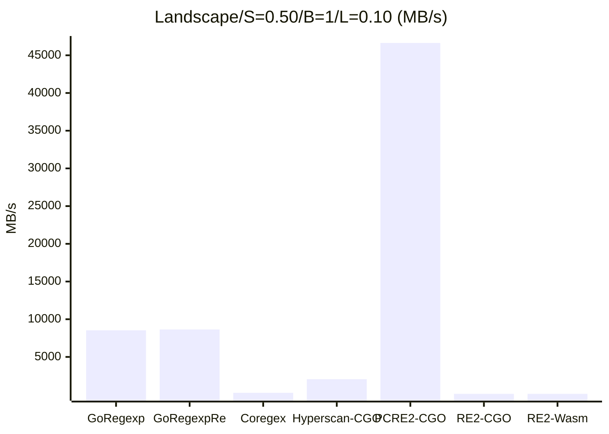
```mermaid
xychart-beta
    title "Landscape/S=0.50/B=1/L=0.10 (MB/s)"
    x-axis ["GoRegexp", "GoRegexpRe", "Coregex", "Hyperscan-CGO", "PCRE2-CGO", "RE2-CGO", "RE2-Wasm"]
    y-axis "MB/s"
    bar [8528.34, 8637.17, 246.37, 2048.83, 46642.13, 104.44, 104.19]
```

### Landscape/S=0.50/B=1/L=0.90
```mermaid
xychart-beta
    title "Landscape/S=0.50/B=1/L=0.90 (MB/s)"
    x-axis ["GoRegexp", "GoRegexpRe", "Coregex", "Hyperscan-CGO", "PCRE2-CGO", "RE2-CGO", "RE2-Wasm"]
    y-axis "MB/s"
    bar [8561.54, 8581.18, 246.26, 2103.73, 46601.40, 192.01, 191.98]
```

### Landscape/S=0.50/B=10/L=0.10
```mermaid
xychart-beta
    title "Landscape/S=0.50/B=10/L=0.10 (MB/s)"
    x-axis ["GoRegexp", "GoRegexpRe", "Coregex", "Hyperscan-CGO", "PCRE2-CGO", "RE2-CGO", "RE2-Wasm"]
    y-axis "MB/s"
    bar [8484.92, 8607.34, 6576.44, 1447.64, 14.85, 104.26, 104.61]
```

### Landscape/S=0.50/B=10/L=0.90
```mermaid
xychart-beta
    title "Landscape/S=0.50/B=10/L=0.90 (MB/s)"
    x-axis ["GoRegexp", "GoRegexpRe", "Coregex", "Hyperscan-CGO", "PCRE2-CGO", "RE2-CGO", "RE2-Wasm"]
    y-axis "MB/s"
    bar [8518.39, 8495.62, 6615.46, 1411.45, 14.79, 191.29, 190.25]
```

### Landscape/S=0.50/B=50/L=0.10
```mermaid
xychart-beta
    title "Landscape/S=0.50/B=50/L=0.10 (MB/s)"
    x-axis ["GoRegexp", "GoRegexpRe", "Coregex", "Hyperscan-CGO", "PCRE2-CGO", "RE2-CGO", "RE2-Wasm"]
    y-axis "MB/s"
    bar [8569.15, 8560.63, 8737.63, 1307.81, 3.58, 103.46, 103.64]
```

### Landscape/S=0.50/B=50/L=0.90
```mermaid
xychart-beta
    title "Landscape/S=0.50/B=50/L=0.90 (MB/s)"
    x-axis ["GoRegexp", "GoRegexpRe", "Coregex", "Hyperscan-CGO", "PCRE2-CGO", "RE2-CGO", "RE2-Wasm"]
    y-axis "MB/s"
    bar [8577.92, 8575.69, 8749.35, 1096.39, 3.60, 190.72, 190.91]
```

### Landscape/S=0.90/B=1/L=0.10
```mermaid
xychart-beta
    title "Landscape/S=0.90/B=1/L=0.10 (MB/s)"
    x-axis ["GoRegexp", "GoRegexpRe", "Coregex", "Hyperscan-CGO", "PCRE2-CGO", "RE2-CGO", "RE2-Wasm"]
    y-axis "MB/s"
    bar [8570.48, 8613.82, 243.95, 836.34, 46332.03, 91.94, 91.82]
```

### Landscape/S=0.90/B=1/L=0.90
```mermaid
xychart-beta
    title "Landscape/S=0.90/B=1/L=0.90 (MB/s)"
    x-axis ["GoRegexp", "GoRegexpRe", "Coregex", "Hyperscan-CGO", "PCRE2-CGO", "RE2-CGO", "RE2-Wasm"]
    y-axis "MB/s"
    bar [8563.45, 8501.05, 246.64, 889.81, 48686.96, 143.52, 143.86]
```

### Landscape/S=0.90/B=10/L=0.10
```mermaid
xychart-beta
    title "Landscape/S=0.90/B=10/L=0.10 (MB/s)"
    x-axis ["GoRegexp", "GoRegexpRe", "Coregex", "Hyperscan-CGO", "PCRE2-CGO", "RE2-CGO", "RE2-Wasm"]
    y-axis "MB/s"
    bar [8561.81, 8597.84, 6505.69, 844.61, 9.97, 91.61, 91.72]
```

### Landscape/S=0.90/B=10/L=0.90
```mermaid
xychart-beta
    title "Landscape/S=0.90/B=10/L=0.90 (MB/s)"
    x-axis ["GoRegexp", "GoRegexpRe", "Coregex", "Hyperscan-CGO", "PCRE2-CGO", "RE2-CGO", "RE2-Wasm"]
    y-axis "MB/s"
    bar [8465.72, 8602.48, 6580.56, 1320.89, 9.90, 143.77, 144.05]
```

### Landscape/S=0.90/B=50/L=0.10
```mermaid
xychart-beta
    title "Landscape/S=0.90/B=50/L=0.10 (MB/s)"
    x-axis ["GoRegexp", "GoRegexpRe", "Coregex", "Hyperscan-CGO", "PCRE2-CGO", "RE2-CGO", "RE2-Wasm"]
    y-axis "MB/s"
    bar [8564.63, 8585.75, 8733.46, 1351.69, 2.40, 91.12, 92.02]
```

### Landscape/S=0.90/B=50/L=0.90
```mermaid
xychart-beta
    title "Landscape/S=0.90/B=50/L=0.90 (MB/s)"
    x-axis ["GoRegexp", "GoRegexpRe", "Coregex", "Hyperscan-CGO", "PCRE2-CGO", "RE2-CGO", "RE2-Wasm"]
    y-axis "MB/s"
    bar [8540.93, 8613.80, 8746.60, 1310.91, 2.34, 143.12, 122.97]
```

### LargeAlternation/Count=10
```mermaid
xychart-beta
    title "LargeAlternation/Count=10 (MB/s)"
    x-axis ["GoRegexp", "GoRegexpRe", "Coregex", "Hyperscan-CGO", "PCRE2-CGO", "RE2-CGO", "RE2-Wasm"]
    y-axis "MB/s"
    bar [29486.00, 35562.80, 6545.80, 1723.82, 49106.93, 1089.98, 1103.34]
```

### LargeAlternation/Count=100
```mermaid
xychart-beta
    title "LargeAlternation/Count=100 (MB/s)"
    x-axis ["GoRegexp", "GoRegexpRe", "Coregex", "Hyperscan-CGO", "PCRE2-CGO", "RE2-CGO", "RE2-Wasm"]
    y-axis "MB/s"
    bar [32065.89, 36151.99, 6461.88, 1917.53, 46277.12, 1082.16, 1106.25]
```

### LargeAlternation/Count=1000
```mermaid
xychart-beta
    title "LargeAlternation/Count=1000 (MB/s)"
    x-axis ["GoRegexp", "GoRegexpRe", "Coregex", "Hyperscan-CGO", "PCRE2-CGO", "RE2-CGO", "RE2-Wasm"]
    y-axis "MB/s"
    bar [27997.04, 36163.02, 6243.67, 1787.86, 26947.45, 1086.11, 1090.26]
```

### LargeAlternation/Count=10000
```mermaid
xychart-beta
    title "LargeAlternation/Count=10000 (MB/s)"
    x-axis ["GoRegexp", "GoRegexpRe", "Coregex", "RE2-CGO", "RE2-Wasm"]
    y-axis "MB/s"
    bar [21305.97, 35107.04, 53.82, 1097.63, 1105.28]
```

### LiteralScan/pat=Sherlock
```mermaid
xychart-beta
    title "LiteralScan/pat=Sherlock (MB/s)"
    x-axis ["GoRegexp", "GoRegexpRe", "Coregex", "Hyperscan-CGO", "PCRE2-CGO", "RE2-CGO", "RE2-Wasm"]
    y-axis "MB/s"
    bar [3296819.58, 39381818.15, 6325520.23, 1933.55, 789471.02, 5446.75, 5523.36]
```

### LiteralScan/pat=The_Adventure_of_the_Speckled_Band
```mermaid
xychart-beta
    title "LiteralScan/pat=The_Adventure_of_the_Speckled_Band (MB/s)"
    x-axis ["GoRegexp", "GoRegexpRe", "Coregex", "Hyperscan-CGO", "PCRE2-CGO", "RE2-CGO", "RE2-Wasm"]
    y-axis "MB/s"
    bar [875324.56, 4277352.06, 2625858.61, 1958.98, 427624.18, 5175.34, 5143.41]
```

### NFAWorstCase/Run
```mermaid
xychart-beta
    title "NFAWorstCase/Run (MB/s)"
    x-axis ["GoRegexp", "GoRegexpRe", "Coregex", "Hyperscan-CGO", "PCRE2-CGO", "RE2-CGO", "RE2-Wasm"]
    y-axis "MB/s"
    bar [19.66, 17.23, 246.14, 1977.63, 46493.45, 137.13, 137.49]
```

### StandardSuite/Alternation/(fo|foo)
```mermaid
xychart-beta
    title "StandardSuite/Alternation/(fo|foo) (MB/s)"
    x-axis ["GoRegexp", "GoRegexpRe", "Coregex", "Hyperscan-CGO", "PCRE2-CGO", "RE2-CGO", "RE2-Wasm"]
    y-axis "MB/s"
    bar [4754620.43, 27168141.26, 12326674.27, 1701.25, 607636.44, 5555.92, 5509.16]
```

### StandardSuite/Anchored/^(?:a)$
```mermaid
xychart-beta
    title "StandardSuite/Anchored/^(?:a)$ (MB/s)"
    x-axis ["GoRegexp", "GoRegexpRe", "Coregex", "Hyperscan-CGO", "PCRE2-CGO", "RE2-CGO", "RE2-Wasm"]
    y-axis "MB/s"
    bar [25927867.60, 60298525.16, 181796877.52, 2121.21, 648473.17, 5592.72, 5456.23]
```

### StandardSuite/CharClass/(?i)[@-A]+
```mermaid
xychart-beta
    title "StandardSuite/CharClass/(?i)[@-A]+ (MB/s)"
    x-axis ["GoRegexp", "GoRegexpRe", "Coregex", "Hyperscan-CGO", "PCRE2-CGO", "RE2-CGO", "RE2-Wasm"]
    y-axis "MB/s"
    bar [6271057.99, 22105125.23, 87733390.43, 1674.36, 608001.31, 5563.61, 5492.19]
```

### StandardSuite/Complex/a+
```mermaid
xychart-beta
    title "StandardSuite/Complex/a+ (MB/s)"
    x-axis ["GoRegexp", "GoRegexpRe", "Coregex", "Hyperscan-CGO", "PCRE2-CGO", "RE2-CGO", "RE2-Wasm"]
    y-axis "MB/s"
    bar [6788199.49, 21369106.66, 12594978.51, 2095.73, 595745.06, 5435.15, 5499.84]
```

### StandardSuite/Literal/a
```mermaid
xychart-beta
    title "StandardSuite/Literal/a (MB/s)"
    x-axis ["GoRegexp", "GoRegexpRe", "Coregex", "Hyperscan-CGO", "PCRE2-CGO", "RE2-CGO", "RE2-Wasm"]
    y-axis "MB/s"
    bar [7381975.51, 47208299.04, 12493446.51, 1753.02, 603077.79, 5566.54, 5539.66]
```

### Synthetic/CCWarp
```mermaid
xychart-beta
    title "Synthetic/CCWarp (MB/s)"
    x-axis ["GoRegexp", "GoRegexpRe", "Coregex", "Hyperscan-CGO", "PCRE2-CGO", "RE2-CGO", "RE2-Wasm"]
    y-axis "MB/s"
    bar [66.38, 32921504.29, 18.68, 896.85, 970.59, 139.28, 141.71]
```

### Synthetic/PureDFA
```mermaid
xychart-beta
    title "Synthetic/PureDFA (MB/s)"
    x-axis ["GoRegexp", "GoRegexpRe", "Coregex", "Hyperscan-CGO", "PCRE2-CGO", "RE2-CGO", "RE2-Wasm"]
    y-axis "MB/s"
    bar [35.09, 242.81, 4.95, 889.27, 5.18, 141.49, 140.20]
```

### Synthetic/SIMDWarp
```mermaid
xychart-beta
    title "Synthetic/SIMDWarp (MB/s)"
    x-axis ["GoRegexp", "GoRegexpRe", "Coregex", "Hyperscan-CGO", "PCRE2-CGO", "RE2-CGO", "RE2-Wasm"]
    y-axis "MB/s"
    bar [30438.49, 30597.59, 36474.13, 2084.49, 50950.07, 1094.25, 1101.39]
```

### Synthetic/SearchWarp
```mermaid
xychart-beta
    title "Synthetic/SearchWarp (MB/s)"
    x-axis ["GoRegexp", "GoRegexpRe", "Coregex", "Hyperscan-CGO", "PCRE2-CGO", "RE2-CGO", "RE2-Wasm"]
    y-axis "MB/s"
    bar [43.05, 3755.79, 1078.04, 2495.98, 1232.53, 139.75, 138.93]
```
